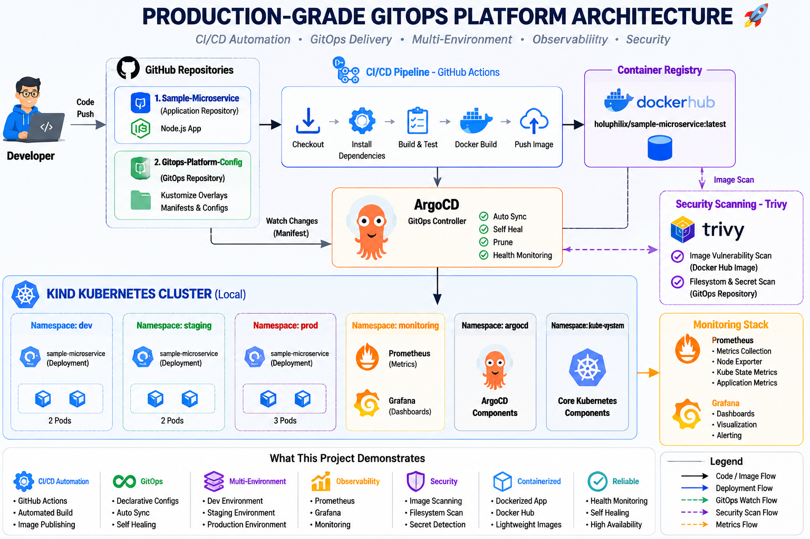

# 🚀 Production-Grade GitOps Platform


A production-grade GitOps platform demonstrating Kubernetes deployment automation, GitOps workflows, CI/CD, observability, security validation, and multi-environment application management using modern cloud-native technologies.

This project implements an end-to-end delivery workflow that includes:

* Kubernetes cluster provisioning with Kind
* ArgoCD-based GitOps deployments
* GitHub Actions CI/CD automation
* Docker image build and distribution through Docker Hub
* Kustomize-based environment management
* Multi-environment deployments (`dev`, `staging`, and `prod`)
* Monitoring and alerting with Prometheus, Grafana, and Alertmanager
* Security scanning with Trivy
* Comprehensive platform validation and documentation

The repository serves as the central documentation hub for the complete platform implementation, providing architecture diagrams, implementation walkthroughs, validation evidence, screenshots, and engineering decisions across every phase of the project lifecycle.

## 📖 Project Overview

This project simulates a modern cloud-native delivery platform using local infrastructure and GitOps practices.

Core implementation areas:

* ☸️ **Kind Kubernetes Cluster:** Local Kubernetes platform used for workload deployment and validation.
* 🐙 **ArgoCD GitOps Workflow:** Continuous reconciliation from GitOps configuration into Kubernetes.
* ⚡ **GitHub Actions CI/CD:** Automated build, test, security scan, Docker image build, and image push workflow.
* 🐳 **Docker Hub:** Container registry for the sample microservice image.
* 🔄 **Multi-Environment Deployment:** Kustomize overlays for `dev`, `staging`, and `prod`.
* 📊 **Monitoring Stack:** Prometheus, Grafana, Alertmanager, Node Exporter, Kube State Metrics, and Prometheus Operator.
* 🔒 **Security Scanning:** Trivy image and filesystem scanning with exported reports.
* ✅ **Platform Validation:** Final validation across ArgoCD, deployments, pods, namespaces, monitoring, repositories, and dashboards.

## 🏗️ Architecture Overview



The architecture separates application source code, GitOps deployment configuration, and project documentation. Application changes flow through GitHub Actions, are packaged into Docker images, published to Docker Hub, referenced by GitOps manifests, synchronized by ArgoCD, deployed to Kubernetes, monitored by Prometheus and Grafana, and validated with Trivy security scans.

## ⚙️ Technology Stack

| Area | Technology | Purpose |
| ---- | ---------- | ------- |
| ☸️ Kubernetes Platform | Kubernetes, Kind | Local cluster for platform and workload validation |
| 🐳 Containerization | Docker | Build and run the sample microservice container |
| 🐳 Container Registry | Docker Hub | Store and distribute the published application image |
| ⚡ CI/CD | GitHub Actions | Build, test, scan, package, and publish the application |
| 🐙 GitOps | ArgoCD | Synchronize GitOps repository state into Kubernetes |
| 🔄 Configuration Management | Kustomize | Manage base manifests and environment overlays |
| 📦 Package Management | Helm | Install the monitoring stack |
| 📊 Monitoring | Prometheus | Collect cluster, workload, and target metrics |
| 📈 Visualization | Grafana | Display Kubernetes and namespace dashboards |
| 🚨 Alerting | Alertmanager | Alerting component installed with kube-prometheus-stack |
| 🔒 Security | Trivy | Scan container image and repository filesystem |
| 🐧 Operating Environment | Linux | Local CLI-based platform operations |
| 🌿 Version Control | Git, GitHub | Source control and workflow integration |

## 🔄 End-to-End GitOps Workflow

```text
Developer
   |
   v
GitHub
   |
   v
GitHub Actions
   |
   v
Docker Hub
   |
   v
GitOps Repository
   |
   v
ArgoCD
   |
   v
Kubernetes
   |
   v
Monitoring
   |
   v
Security Validation
```

This workflow demonstrates how source code changes become validated container images, how deployment configuration is managed declaratively in Git, and how ArgoCD reconciles Kubernetes workloads across multiple environments.

## 📂 Repository Structure

```text
Production-Grade-GitOps-Platform
├── README.md
├── diagrams
│   ├── phase-00-project-initialization-diagram.png
│   ├── production-grade-gitops-platform-architecture.png
│   ├── task-01-kind-cluster-diagram.png
│   ├── task-02-argocd-installation-diagram.png
│   ├── task-03-sample-microservice-diagram.png
│   ├── task-04-github-actions-diagram.png
│   ├── task-05-gitops-config-diagram.png
│   ├── task-06-argocd-sync-diagram.png
│   ├── task-07-kustomize-environments-diagram.png
│   ├── task-08-monitoring-stack-diagram.png
│   ├── task-09-security-scanning-diagram.png
│   └── task-10-final-validation-diagram.png
├── docs
│   ├── phase-00-project-initialization.md
│   ├── task-01-kind-cluster.md
│   ├── task-02-argocd-installation.md
│   ├── task-03-sample-microservice.md
│   ├── task-04-github-actions.md
│   ├── task-05-gitops-config.md
│   ├── task-06-argocd-sync.md
│   ├── task-07-kustomize-environments.md
│   ├── task-08-monitoring-stack.md
│   ├── task-09-security-scanning.md
│   └── task-10-final-validation.md
└── screenshots
    ├── task-01-kind-cluster
    ├── task-02-argocd
    ├── task-03-microservice
    ├── task-04-github-actions
    ├── task-05-gitops-config
    ├── task-06-gitops-deployments
    ├── task-07-multi-environment
    ├── task-08-monitoring-stack
    ├── task-09-security-scanning
    └── task-10-final-validation
```

## 🗺️ Implementation Roadmap

| Phase | Objective | Status | Documentation |
| ----- | --------- | ------ | ------------- |
| Phase 00 | Plan repository structure, documentation strategy, and architecture | ✅ Completed | [phase-00-project-initialization.md](docs/phase-00-project-initialization.md) |
| Task 01 | Provision and validate a local Kind Kubernetes cluster | ✅ Completed | [task-01-kind-cluster.md](docs/task-01-kind-cluster.md) |
| Task 02 | Install and validate ArgoCD as the GitOps controller | ✅ Completed | [task-02-argocd-installation.md](docs/task-02-argocd-installation.md) |
| Task 03 | Build and validate the sample Node.js microservice | ✅ Completed | [task-03-sample-microservice.md](docs/task-03-sample-microservice.md) |
| Task 04 | Implement GitHub Actions CI/CD and Docker Hub publishing | ✅ Completed | [task-04-github-actions.md](docs/task-04-github-actions.md) |
| Task 05 | Create GitOps base manifests, overlays, and ArgoCD Application config | ✅ Completed | [task-05-gitops-config.md](docs/task-05-gitops-config.md) |
| Task 06 | Validate automated GitOps synchronization and scaling | ✅ Completed | [task-06-argocd-sync.md](docs/task-06-argocd-sync.md) |
| Task 07 | Deploy and validate dev, staging, and prod environments | ✅ Completed | [task-07-kustomize-environments.md](docs/task-07-kustomize-environments.md) |
| Task 08 | Install and validate monitoring and observability stack | ✅ Completed | [task-08-monitoring-stack.md](docs/task-08-monitoring-stack.md) |
| Task 09 | Run Trivy security scans and export security reports | ✅ Completed | [task-09-security-scanning.md](docs/task-09-security-scanning.md) |
| Task 10 | Complete final platform validation and project documentation | ✅ Completed | [task-10-final-validation.md](docs/task-10-final-validation.md) |

## 📚 Documentation Navigation

* [Phase 00 - Project Initialization](docs/phase-00-project-initialization.md)
* [Task 01 - Local Kubernetes Platform Setup with Kind](docs/task-01-kind-cluster.md)
* [Task 02 - ArgoCD Installation and Configuration](docs/task-02-argocd-installation.md)
* [Task 03 - Sample Microservice Development](docs/task-03-sample-microservice.md)
* [Task 04 - GitHub Actions CI Pipeline](docs/task-04-github-actions.md)
* [Task 05 - GitOps Repository Configuration](docs/task-05-gitops-config.md)
* [Task 06 - Automated GitOps Deployments](docs/task-06-argocd-sync.md)
* [Task 07 - Multi-Environment Management](docs/task-07-kustomize-environments.md)
* [Task 08 - Monitoring and Observability](docs/task-08-monitoring-stack.md)
* [Task 09 - Security Scanning and Compliance](docs/task-09-security-scanning.md)
* [Task 10 - Final Validation and Documentation](docs/task-10-final-validation.md)

## 📸 Project Screenshots

### ArgoCD Multi-Environment Dashboard


Caption: ArgoCD managing independent dev, staging, and production Applications from the GitOps repository.

### Final ArgoCD Dashboard


Caption: Final ArgoCD dashboard showing all Applications in `Healthy` and `Synced` state.

### Multi-Environment Deployment Validation


Caption: Kubernetes deployment validation showing expected replica counts across dev, staging, and production.

### Monitoring Stack Validation


Caption: Monitoring namespace pods showing Prometheus, Grafana, Alertmanager, Node Exporter, Kube State Metrics, and Prometheus Operator.

### Grafana Cluster Dashboard


Caption: Grafana Kubernetes cluster dashboard showing platform and namespace metrics.

### Security Scanning


Caption: Trivy container image scan showing Alpine base image detection and vulnerability reporting.

## 🎯 Key Achievements

* Built a local Kubernetes platform using Kind.
* Installed and validated ArgoCD as a GitOps controller.
* Implemented CI/CD with GitHub Actions and Docker Hub.
* Created Kubernetes base manifests and Kustomize overlays.
* Delivered automated GitOps synchronization with ArgoCD.
* Deployed the sample microservice across `dev`, `staging`, and `prod`.
* Installed Prometheus, Grafana, Alertmanager, Node Exporter, Kube State Metrics, and Prometheus Operator.
* Validated monitoring dashboards and Prometheus targets.
* Performed Trivy image and filesystem scans.
* Completed final platform validation with documented evidence.

## 💡 Skills Demonstrated

* GitOps
* Kubernetes
* ArgoCD
* CI/CD
* Docker
* Monitoring
* DevSecOps
* Kustomize
* Observability
* Infrastructure Validation
* Linux Troubleshooting
* Technical Documentation

## 🔗 Related Repositories

### Sample-Microservice

https://github.com/Holuphilix/Sample-Microservice

Production-ready Node.js microservice featuring Docker containerization, GitHub Actions CI/CD, Prometheus metrics, security validation, and Kubernetes deployment readiness.

### Gitops-Platform-Config

https://github.com/Holuphilix/Gitops-Platform-Config

Declarative GitOps configuration repository containing Kubernetes manifests, Kustomize overlays, ArgoCD Applications, and multi-environment deployment configuration.

Together, these repositories demonstrate a complete cloud-native GitOps workflow from application development through deployment automation and platform operations.

## 🚀 Future Improvements

The following items are realistic future enhancements and are not part of the current implementation:

* Ingress Controller for external application access.
* TLS Certificates for secure service exposure.
* External DNS automation.
* Kubernetes Network Policies.
* Automated Rollback workflows.
* Multi-Cluster GitOps.
* ArgoCD ApplicationSets.
* Secret Management with a dedicated secrets solution.

## 🏁 Conclusion

This project demonstrates a complete local GitOps platform implementation with CI/CD, Kubernetes deployment automation, multi-environment management, monitoring, security scanning, and final validation.

The documentation is structured so recruiters can understand the project from this README, while hiring managers and interviewers can inspect each task document for detailed commands, screenshots, validation outputs, and implementation decisions.

## 👨‍💻 Author

**Philip Oluwaseyi Oludolamu**

DevOps Engineer | Cloud Engineer | AWS | Kubernetes | Terraform | GitOps | CI/CD

* GitHub: [Holuphilix](https://github.com/Holuphilix)
* Portfolio: [philipoludolamu.com](https://www.philipoludolamu.com)
* LinkedIn: [philip-oludolamu](https://www.linkedin.com/in/philip-oludolamu/)

Passionate about designing scalable cloud infrastructure, implementing Infrastructure as Code (IaC), automating CI/CD pipelines, and building cloud-native platforms using modern DevOps and Platform Engineering practices.