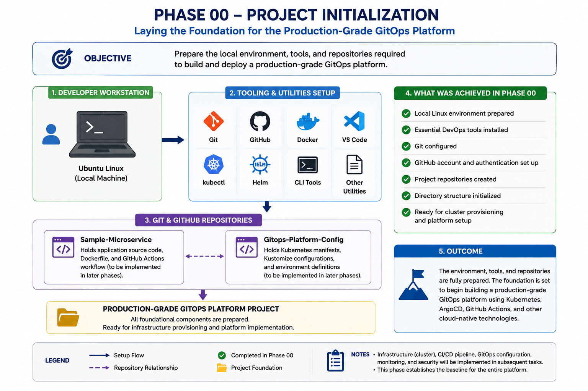
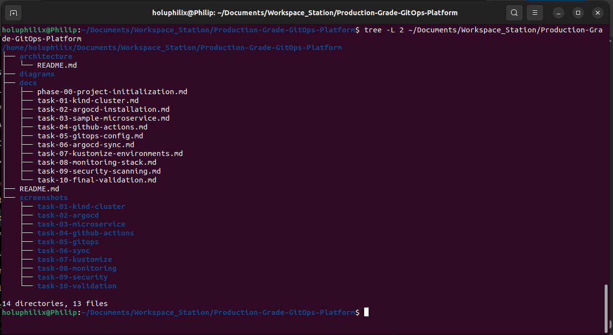
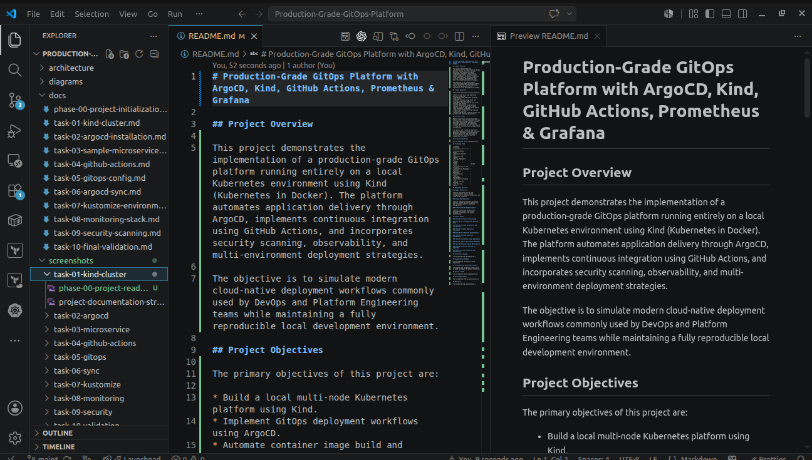
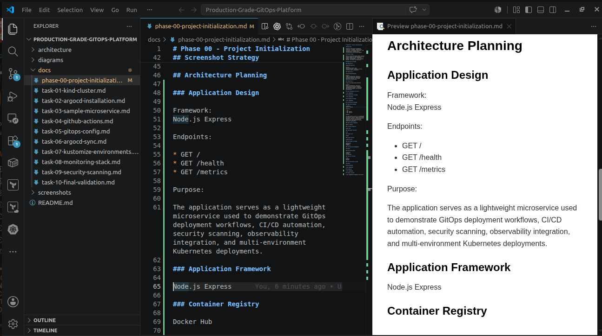
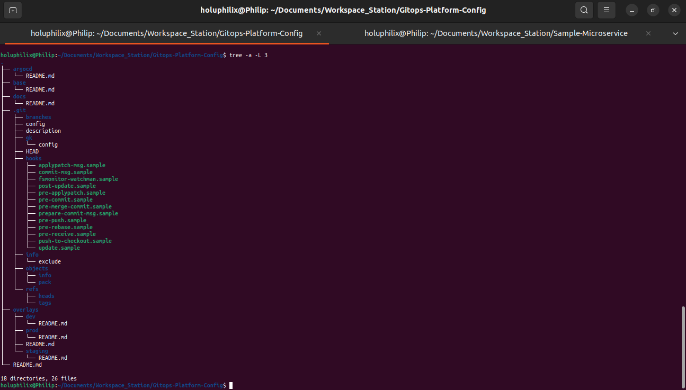
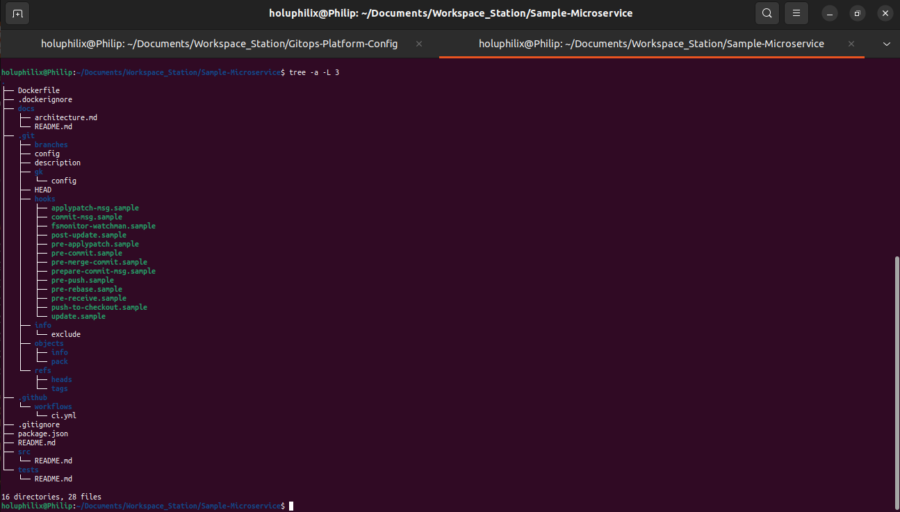

# 🚀 Phase 00 - Project Initialization

## 🎯 Objective

Establish the project foundation, repository strategy, documentation structure, architecture decisions, and implementation roadmap before infrastructure provisioning begins.

## 📖 Background

This phase established the documentation-first foundation for the GitOps platform project, including repository responsibilities, project scope, screenshot strategy, and architecture planning.

## 🏗️ Architecture Diagram

This diagram summarizes the workflow and technical scope for phase 00 - project initialization.

## 📋 Prerequisites

* Local Linux workstation.
* Git installed.
* Project workspace available.
* Repository strategy defined.

## ⚙️ Implementation Steps

Implementation details are documented in the existing project scope, repository strategy, workspace structure, documentation strategy, screenshot strategy, architecture planning, and deliverables sections below.

## Project Scope
Build a production-grade GitOps platform running locally on Kind Kubernetes with ArgoCD, GitHub Actions, Docker Hub, Kustomize, Prometheus, Grafana, Alertmanager, and Trivy.

## Repository Strategy
### Repository 1

Sample-Microservice

Purpose:
Application source code, containerization, testing, security scanning, and CI automation.

### Repository 2

Gitops-Platform-Config

Purpose:
GitOps configuration repository containing Kubernetes manifests, Kustomize overlays, and ArgoCD application definitions.

### Repository 3

Production-Grade-GitOps-Platform

Purpose:
Master documentation repository containing architecture diagrams, implementation guides, screenshots, operational evidence, and project documentation.

## Local Workspace Structure
The local workspace was organized around separate repositories for the sample microservice, GitOps configuration, and project documentation.

### Screenshot Evidence: Project Documentation Structure

The documentation repository structure was organized to support phase-based implementation guides, task-level evidence, and operational validation artifacts.

Caption: Project Documentation Structure

## Documentation Strategy
The documentation strategy uses phase-based task files, screenshots, diagrams, command evidence, and validation summaries to make the implementation easy to review.

### Screenshot Evidence: Initial README Foundation

The initial project README foundation was established to define the purpose, scope, and structure of the production-grade GitOps platform documentation repository.

Caption: Initial Project README Foundation

## Screenshot Strategy
Screenshots were captured during each implementation phase to preserve operational evidence for cluster setup, ArgoCD, CI/CD, GitOps synchronization, monitoring, security scanning, and final validation.

## Architecture Planning
### Application Design

Framework:
Node.js Express

Endpoints:

* GET /
* GET /health
* GET /metrics

Purpose:

The application serves as a lightweight microservice used to demonstrate GitOps deployment workflows, CI/CD automation, security scanning, observability integration, and multi-environment Kubernetes deployments.

#### Screenshot Evidence: Application Architecture Planning

The application architecture was planned around a lightweight Node.js Express microservice with operational endpoints for health checks and Prometheus metrics.

Caption: Application Architecture Planning

### Container Registry

Docker Hub

### Kubernetes Platform

Kind

### GitOps Tool

ArgoCD

### CI/CD Platform

GitHub Actions

### Environment Strategy

Development
Staging
Production

### Configuration Management

Kustomize

#### Screenshot Evidence: GitOps Repository Structure Planning

The GitOps configuration repository structure was planned to support declarative Kubernetes manifests, Kustomize overlays, and ArgoCD application definitions.

Caption: GitOps Repository Structure Planning

### Monitoring Stack

Prometheus
Grafana
Alertmanager

### Security Tooling

Trivy

#### Screenshot Evidence: Sample Microservice Repository Structure Planning

The sample microservice repository structure was planned to separate application source code, runtime configuration, containerization, and CI automation.

Caption: Sample Microservice Repository Structure Planning

## Deliverables
### Completed Deliverables

* Project documentation repository established.
* Architecture planning completed.
* Screenshot strategy established.
* Node.js Express selected as the application framework.
* Application endpoint strategy defined.
* GitOps repository initialized.
* Microservice repository initialized.
* Documentation structure created for all project phases.

## ⚙️ Commands Executed

No infrastructure commands were required for this planning phase. The completed work focused on repository organization, documentation structure, and architecture planning.

## ✅ Validation

### Validation Evidence

The following validation activities were completed:

* Documentation repository structure verified.
* GitOps repository structure verified.
* Sample microservice repository structure verified.
* Screenshot evidence collected and stored.
* Initial architecture decisions documented.

## 📸 Screenshots

### Phase 00 Application Architecture

Caption: Phase 00 project planning and repository foundation evidence.

### Phase 00 Gitops Config Structure

Caption: Phase 00 project planning and repository foundation evidence.

### Phase 00 Project Readme Foundation

Caption: Phase 00 project planning and repository foundation evidence.

### Phase 00 Sample Microservice Structure

Caption: Phase 00 project planning and repository foundation evidence.

## 🎉 Key Outcomes

The project foundation was completed, including repository strategy, documentation standards, architecture planning, and initial operational evidence.

## 📚 Lessons Learned

Clear repository boundaries, documentation standards, and evidence capture plans made the later GitOps, monitoring, security, and validation phases easier to implement and review.

## 🏁 Conclusion

The Phase 00 - Project Initialization phase is complete and validated with documented operational evidence.
