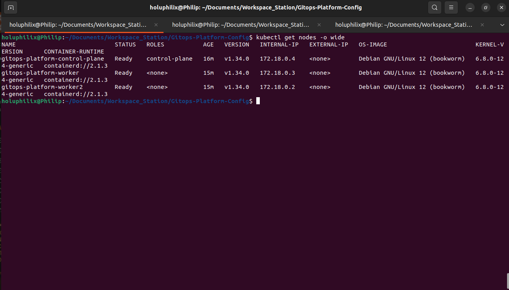
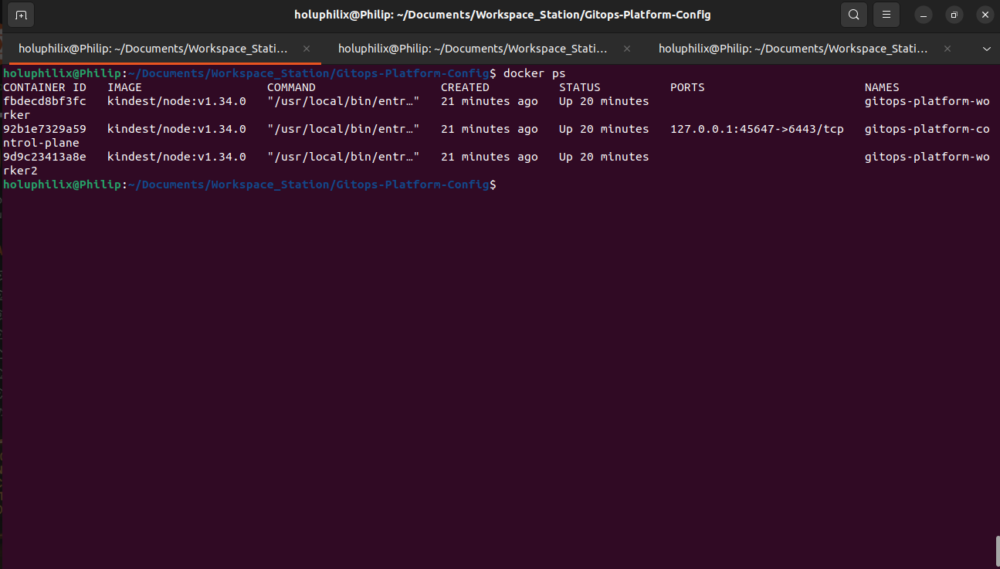
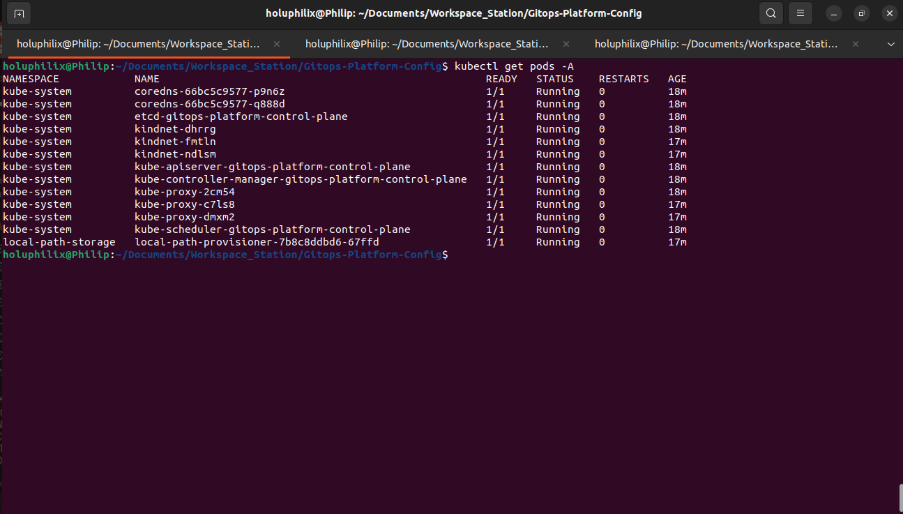

# Task 01 - Local Kubernetes Platform Setup with Kind

## Objective

Provision a production-style local Kubernetes environment using Kind (Kubernetes in Docker) to serve as the foundational platform for GitOps deployment, observability, and security tooling.

## Why Kind?

Kind provides a lightweight, reproducible Kubernetes environment that runs entirely within Docker containers. It enables local platform engineering workflows without requiring cloud infrastructure.

For this project, Kind is used to simulate a multi-node Kubernetes cluster capable of hosting ArgoCD, Prometheus, Grafana, Alertmanager, and application workloads.

## Cluster Architecture

Control Plane Nodes:
1

Worker Nodes:
2

Total Nodes:
3

## Prerequisites

* Docker
* Kind
* kubectl
* Helm
* Terraform

## Implementation Steps

### Step 1: Verify Local Tooling

The following tools were verified before cluster provisioning:

* Kind v0.30.0
* kubectl v1.35.5
* Docker v29.5.3
* Helm v3.21.0
* Terraform v1.15.5

### Step 2: Create Kind Cluster Configuration

A custom Kind configuration file was created to provision a multi-node Kubernetes cluster consisting of:

* 1 Control Plane Node
* 2 Worker Nodes

### Step 3: Provision the Cluster

Cluster creation command:

```bash
kind create cluster \
  --name gitops-platform \
  --config kind/kind-cluster.yaml
```

#### Screenshot Evidence: Successful Kind Cluster Creation

The cluster creation output confirmed that the local multi-node Kind Kubernetes platform was provisioned successfully.



Caption: Successful Kind Cluster Creation

### Step 4: Validate Cluster Health

Validation commands:

```bash
kubectl get nodes -o wide
kubectl get pods -A
docker ps
```

#### Screenshot Evidence: Multi-Node Kubernetes Cluster Verification

The Docker node validation confirmed that the Kind environment was running one control plane node and two worker nodes.



Caption: Multi-Node Kubernetes Cluster Verification

#### Screenshot Evidence: Kubernetes System Pods Validation

The Kubernetes system pod validation confirmed that core cluster components were initialized and running across the platform.



Caption: Kubernetes System Pods Validation

Validation confirmed:

* All nodes reached Ready state.
* Kubernetes system components were healthy.
* Worker nodes successfully joined the cluster.
* Networking and storage components initialized successfully.

## Validation

The Kind cluster was successfully deployed with:

- 1 Control Plane node
- 2 Worker nodes
- All nodes in Ready state
- Core Kubernetes system pods running successfully

Validation commands:

kubectl get nodes
kubectl get pods -A
docker ps

## Screenshots

The screenshots embedded in the implementation and validation sections above provide evidence for cluster creation, node-level verification, and Kubernetes system component health.

## Lessons Learned

During initial cluster creation, worker nodes failed to join due to a Kubernetes node image version mismatch.

The cluster configuration was simplified to allow Kind to manage node image selection automatically, resulting in a successful multi-node cluster deployment.

This reinforced the importance of maintaining Kubernetes version consistency across cluster nodes.
