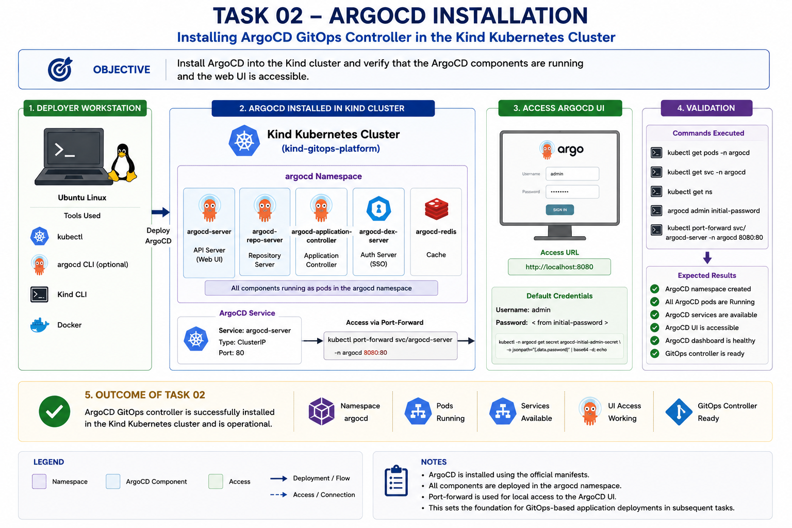
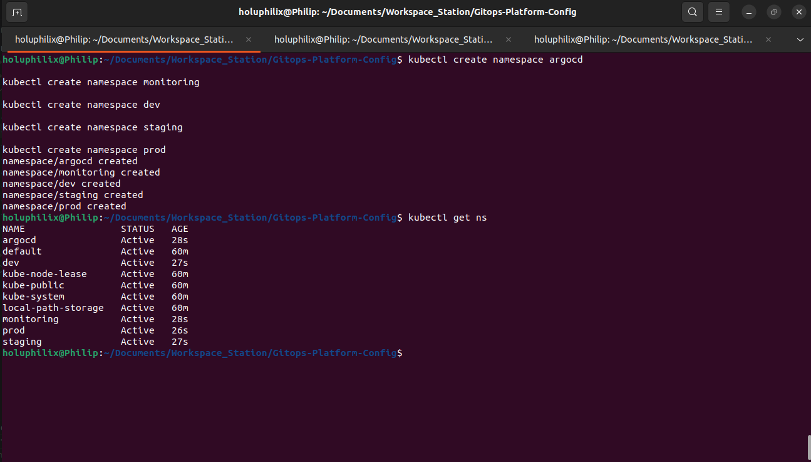
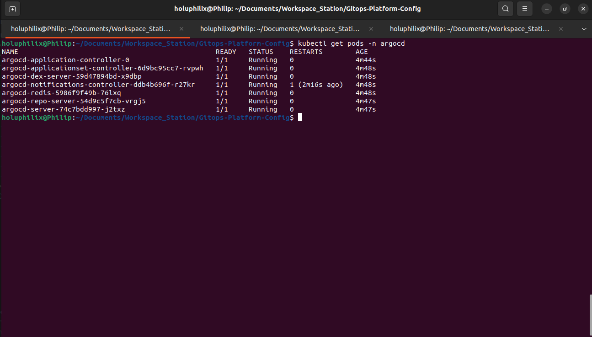
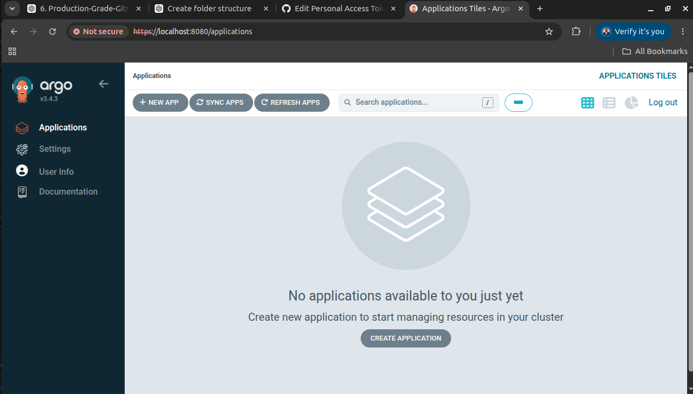

# 🚀 Task 02 - ArgoCD Installation and Configuration

## 🎯 Objective

Install and configure ArgoCD as the GitOps controller for the Kubernetes platform.

ArgoCD will continuously monitor the GitOps repository and synchronize Kubernetes resources automatically, enabling a declarative deployment workflow.

## 📖 Background

ArgoCD provides the GitOps reconciliation layer for the platform by continuously comparing Git-defined desired state with live Kubernetes resources.

## 🏗️ Architecture Diagram



This diagram summarizes the workflow and technical scope for task 02 - argocd installation and configuration.

## 📋 Prerequisites

* Kind cluster running.
* `kubectl` configured for the `gitops-platform` cluster.
* Required platform namespaces planned.
* Internet access available for the ArgoCD installation manifest.

## ⚙️ Implementation Steps

### Step 1: Prepare Platform Namespaces

Dedicated namespaces were created to provide logical separation between platform services and application workloads.

Namespaces created:

* argocd
* monitoring
* dev
* staging
* prod

Command used:

```bash
kubectl create namespace argocd
kubectl create namespace monitoring
kubectl create namespace dev
kubectl create namespace staging
kubectl create namespace prod
```

Validation:

```bash
kubectl get ns
```

All namespaces were successfully created and reached the Active state.

#### Screenshot Evidence: Platform Namespace Preparation

The namespace validation confirmed that the platform, monitoring, and application environment namespaces were created successfully.



Caption: Platform Namespace Preparation

### Step 2: Install ArgoCD

ArgoCD was installed into the dedicated `argocd` namespace using the official installation manifest.

Command used:

```bash
kubectl apply -n argocd \
-f https://raw.githubusercontent.com/argoproj/argo-cd/stable/manifests/install.yaml
```

Installed components:

* ArgoCD Server
* ArgoCD Repository Server
* ArgoCD Application Controller
* ArgoCD ApplicationSet Controller
* ArgoCD Notifications Controller
* ArgoCD Redis
* ArgoCD Dex Server

Validation command:

```bash
kubectl get pods -n argocd
```

All ArgoCD components successfully reached the Running state.

#### Screenshot Evidence: ArgoCD Components Running Successfully

The ArgoCD pod validation confirmed that all controller, server, repository, Redis, Dex, ApplicationSet, and notification components were running in the `argocd` namespace.



Caption: ArgoCD Components Running Successfully

## Why ArgoCD?
ArgoCD provides:

* Continuous synchronization between Git and Kubernetes
* Automated deployment reconciliation
* Deployment visibility
* Rollback capabilities
* GitOps-based change management

## ⚙️ Commands Executed

Commands executed are documented in the implementation and validation sections below, including namespace creation, ArgoCD installation, pod validation, and dashboard port forwarding.

## ✅ Validation

The following validation checks were performed:

### Namespace Validation

```bash
kubectl get ns
```

Verified namespaces:

* argocd
* monitoring
* dev
* staging
* prod

### ArgoCD Component Validation

```bash
kubectl get pods -n argocd
```

Verified:

* argocd-server
* argocd-repo-server
* argocd-application-controller
* argocd-applicationset-controller
* argocd-dex-server
* argocd-redis
* argocd-notifications-controller

All components reached the Running state.

### ArgoCD UI Validation

Port forwarding was established:

```bash
kubectl port-forward svc/argocd-server -n argocd 8080:443
```

The ArgoCD web interface was successfully accessed through:

```text
https://localhost:8080
```

Authentication using the initial admin credentials was successful and the dashboard loaded correctly.

#### Screenshot Evidence: ArgoCD Dashboard Access Validation

The dashboard validation confirmed that the ArgoCD UI was reachable through the local port-forward and that authentication completed successfully.



Caption: ArgoCD Dashboard Access Validation

## 📸 Screenshots

### Task 02 Platform Namespaces


Caption: Task 02 ArgoCD installation and dashboard access validation evidence.

### Task 02 Argocd Components Running


Caption: Task 02 ArgoCD installation and dashboard access validation evidence.

### Task 02 Argocd Dashboard Login


Caption: Task 02 ArgoCD installation and dashboard access validation evidence.

## 🎉 Key Outcomes

ArgoCD was installed successfully and validated as the GitOps controller for the platform.

## 📚 Lessons Learned

ArgoCD provides a clear operational boundary between Git-defined desired state and live Kubernetes resources.

Validating namespaces, controller pods, and dashboard access early created confidence for later GitOps deployment phases.

## 🏁 Conclusion

The Task 02 - ArgoCD Installation and Configuration phase is complete and validated with documented operational evidence.
