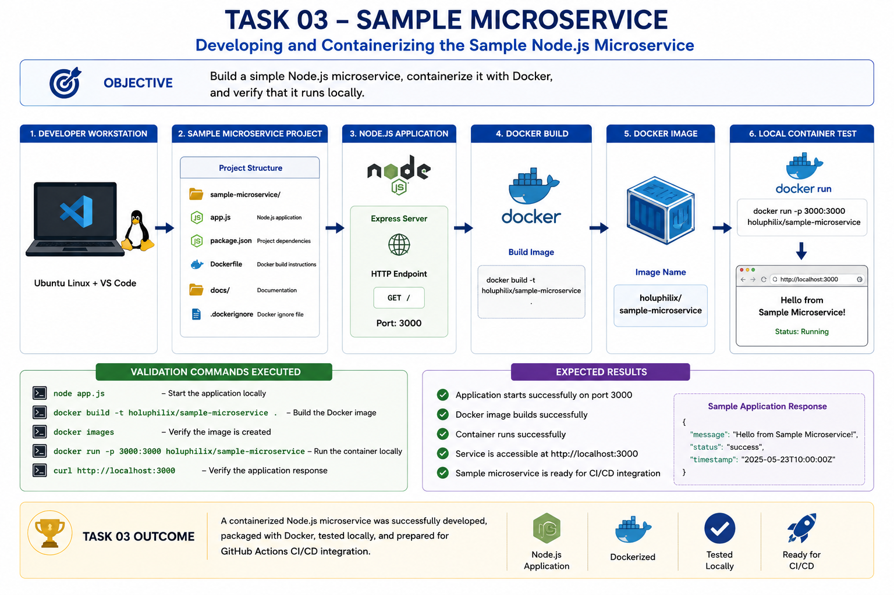
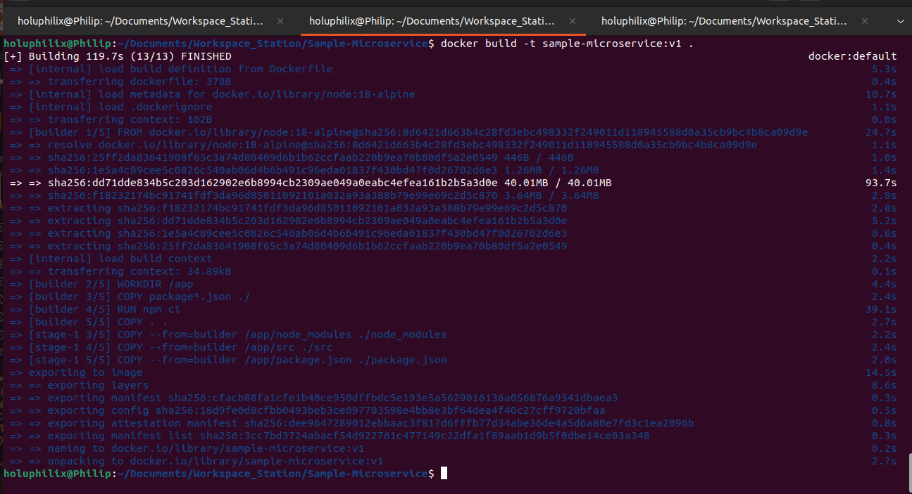
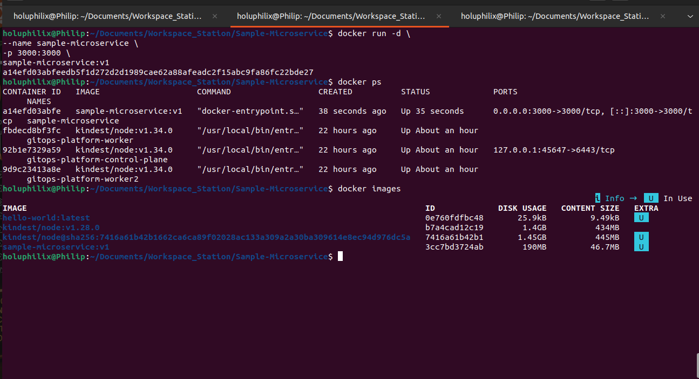
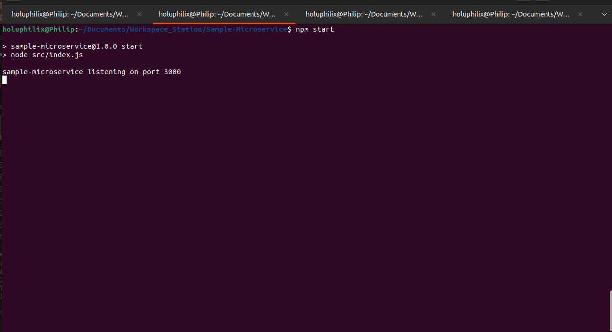
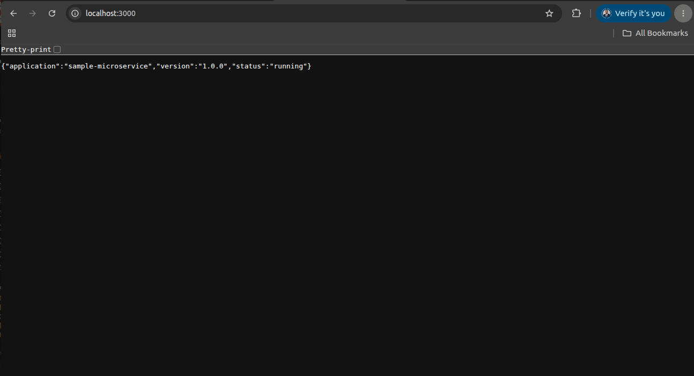
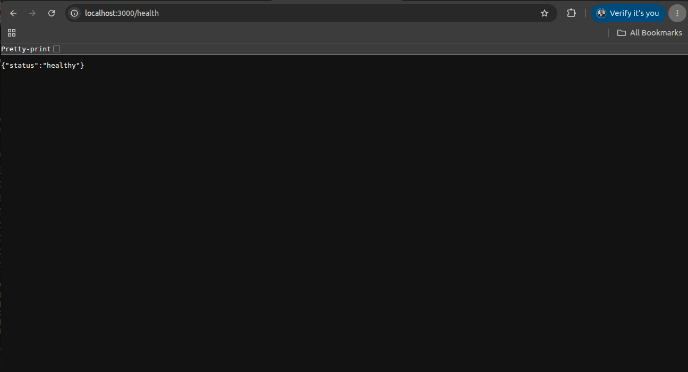
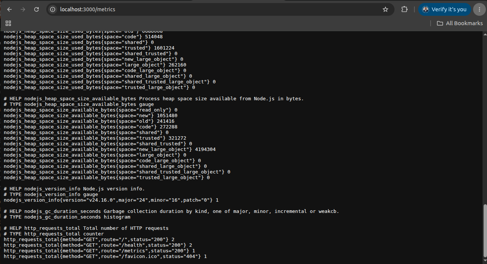

# 🚀 Task 03 - Sample Microservice Development

## 🎯 Objective

Develop a lightweight Node.js Express microservice that will serve as the workload deployed through the GitOps platform.

The application exposes operational endpoints for service validation and Prometheus monitoring.

## 📖 Background

The sample microservice provides a lightweight application workload for containerization, CI/CD validation, GitOps deployment, monitoring, and security scanning.

## 🏗️ Architecture Diagram



This diagram summarizes the workflow and technical scope for task 03 - sample microservice development.

## 📋 Prerequisites

* Node.js application files available.
* Docker installed locally.
* Application dependencies installed.
* Local port access available for endpoint validation.

## ⚙️ Implementation Steps

Implementation details are documented in the technology stack, endpoint, validation, and container validation sections below.

## Technology Stack
* Node.js
* Express
* Prometheus Client Library (prom-client)

## Application Endpoints
### GET /

Returns application metadata.

Example response:

```json
{
  "application": "sample-microservice",
  "version": "1.0.0",
  "status": "running"
}
```

### GET /health

Returns service health information.

Example response:

```json
{
  "status": "healthy"
}
```

### GET /metrics

Exposes Prometheus metrics for monitoring and observability.

## Container Validation
The microservice was containerized to support Kubernetes deployment through the GitOps platform. Docker validation confirmed that the image built successfully and that the containerized application could run locally.

### Screenshot Evidence: Docker Image Build Validation

The Docker image build validation confirmed that the application container image was built successfully from the microservice source code.



Caption: Docker Image Build Validation

### Screenshot Evidence: Docker Container Runtime Validation

The Docker container runtime validation confirmed that the built image could start successfully as a running container.



Caption: Docker Container Runtime Validation

## ⚙️ Commands Executed

Commands executed are documented throughout the validation sections, including application endpoint checks, Docker image build validation, and container runtime validation.

## ✅ Validation

Application started successfully:

```bash
npm start
```

Output:

```text
sample-microservice listening on port 3000
```

### Screenshot Evidence: Node.js Application Running Locally

The local runtime validation confirmed that the Express application started successfully and listened on port `3000`.



Caption: Node.js Application Running Locally

Endpoint validation:

```bash
curl http://localhost:3000/
curl http://localhost:3000/health
curl http://localhost:3000/metrics
```

All endpoints returned successful responses.

### Screenshot Evidence: Root Endpoint Validation

The root endpoint validation confirmed that the service returned application metadata, version information, and runtime status.



Caption: Root Endpoint Validation

### Screenshot Evidence: Health Endpoint Validation

The health endpoint validation confirmed that the service returned a healthy operational status.



Caption: Health Endpoint Validation

### Screenshot Evidence: Prometheus Metrics Endpoint Validation

The metrics endpoint validation confirmed that the service exposed Prometheus-compatible metrics for observability integration.



Caption: Prometheus Metrics Endpoint Validation

## 📸 Screenshots

### Task 03 Root Endpoint


Caption: Task 03 sample microservice endpoint, Docker image, and runtime validation evidence.

### Task 03 Health Endpoint


Caption: Task 03 sample microservice endpoint, Docker image, and runtime validation evidence.

### Task 03 Metrics Endpoint


Caption: Task 03 sample microservice endpoint, Docker image, and runtime validation evidence.

### Task 03 Application Running


Caption: Task 03 sample microservice endpoint, Docker image, and runtime validation evidence.

### Task 03 Docker Image Built


Caption: Task 03 sample microservice endpoint, Docker image, and runtime validation evidence.

### Task 03 Docker Container Running


Caption: Task 03 sample microservice endpoint, Docker image, and runtime validation evidence.

## 🎉 Key Outcomes

The sample microservice was implemented, containerized, and validated locally before being used in CI/CD and GitOps workflows.

## 📚 Lessons Learned

A small service with health and metrics endpoints is useful for validating the full platform lifecycle without adding unnecessary application complexity.

## 🏁 Conclusion

The Task 03 - Sample Microservice Development phase is complete and validated with documented operational evidence.
