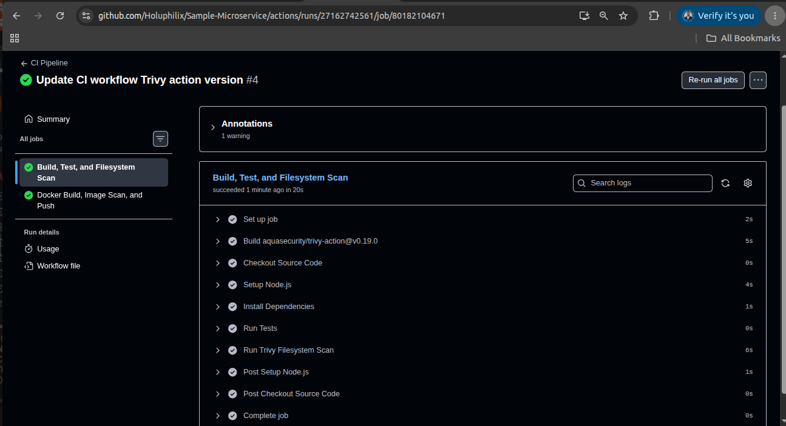
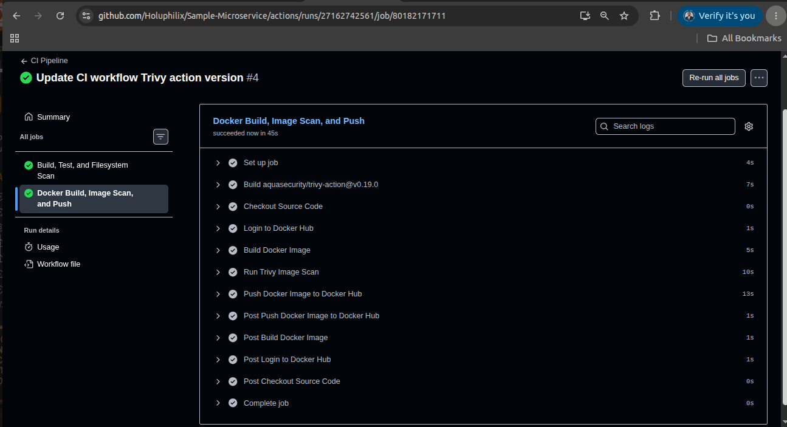
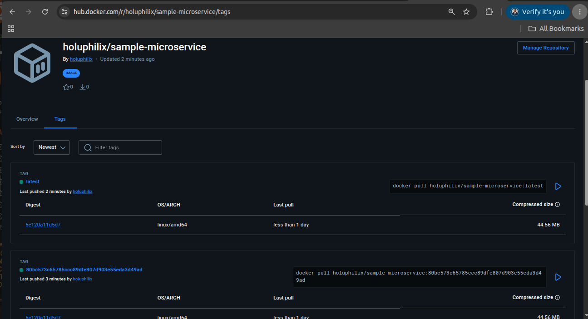

# Task 04 - GitHub Actions CI Pipeline

## Objective

Implement a production-style CI pipeline using GitHub Actions.

The pipeline will automatically validate application code, perform security scanning, build a Docker image, and publish the image to Docker Hub.

## Pipeline Stages

1. Source Code Checkout
2. Node.js Environment Setup
3. Dependency Installation
4. Application Testing
5. Trivy Filesystem Security Scan
6. Docker Image Build
7. Trivy Container Image Scan
8. Docker Hub Authentication
9. Docker Image Publication

## Why This Pipeline?

The CI pipeline provides:

* Automated validation
* Security scanning
* Consistent image creation
* Repeatable deployments
* Reduced deployment risk

## Implementation Steps

### Step 1: Create GitHub Actions Workflow

A GitHub Actions workflow was implemented to automate application validation, security scanning, Docker image creation, container image scanning, and Docker Hub publication.

The workflow executes on repository changes and provides repeatable CI validation before application deployment through the GitOps platform.

### Step 2: Run Build, Test, and Filesystem Security Scan

The pipeline validates the application source code by installing dependencies, executing the build and test stages, and running a Trivy filesystem scan against the repository contents.

This stage provides early feedback for application correctness and source-level vulnerability detection before container image creation.

#### Screenshot Evidence: Build, Test, and Trivy Filesystem Scan Completion

The workflow execution evidence confirms that the CI job completed successfully, including build and test validation and the Trivy filesystem scan stage.

Caption: Build and test stage completion with Trivy filesystem scan execution

### Step 3: Build, Scan, and Publish Docker Image

After source validation completed successfully, the workflow built the Docker image, scanned the resulting image with Trivy, authenticated to Docker Hub, and pushed the image to the remote registry.

This stage confirms that the application can be packaged consistently and published for downstream GitOps deployment workflows.

#### Screenshot Evidence: Docker Image Build, Trivy Image Scan, and Docker Hub Push

The Docker pipeline evidence confirms successful image build, Trivy container image scan execution, and image publication to Docker Hub.

Caption: Docker image build, Trivy image scan, and Docker image push to Docker Hub

### Step 4: Validate Docker Hub Repository Tags

The Docker Hub repository was validated after the workflow completed to confirm that the published image tags were available for GitOps deployment references.

#### Screenshot Evidence: Docker Hub Repository Tags

The Docker Hub repository evidence confirms that the CI pipeline published image tags successfully and that the image is available from the container registry.

Caption: Docker Hub repository tags published by the GitHub Actions workflow

## Validation

The following validation checks were performed:

* GitHub Actions workflow execution completed successfully.
* Build and test stages completed successfully.
* Trivy filesystem scan executed successfully.
* Docker image build completed successfully.
* Trivy image scan executed successfully.
* Docker image push to Docker Hub completed successfully.
* Docker Hub repository tags were verified.

## Screenshots

The screenshots embedded in the implementation sections above provide operational evidence for workflow execution, build and test validation, Trivy filesystem scanning, Docker image creation, Trivy image scanning, Docker Hub publication, and repository tag verification.

## Lessons Learned

To be completed during implementation.
