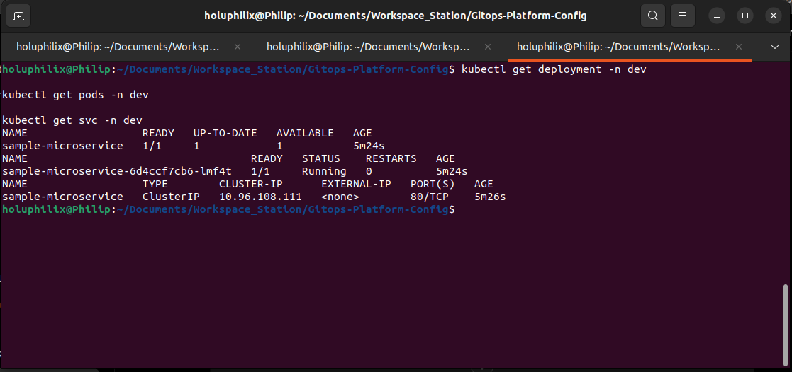
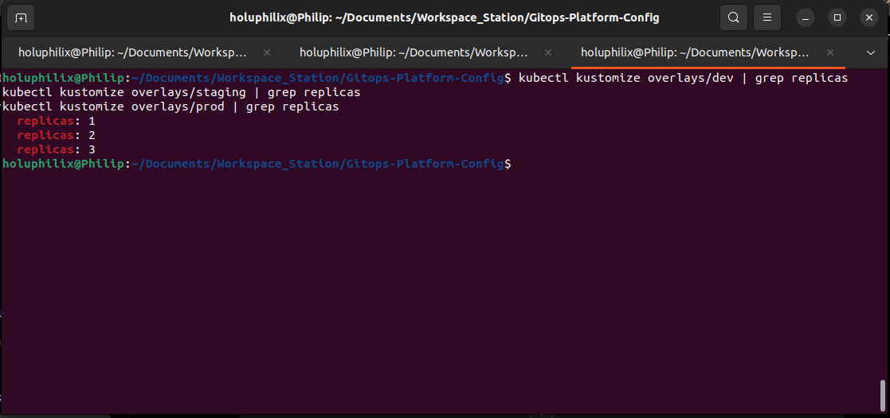
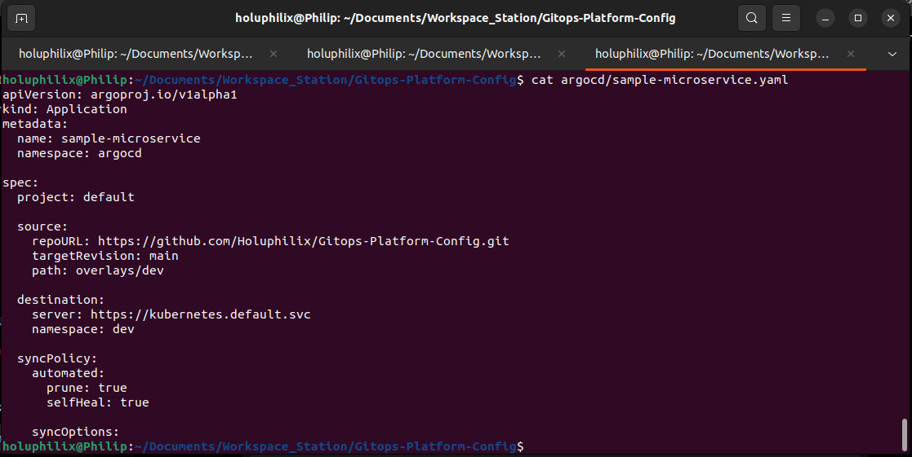
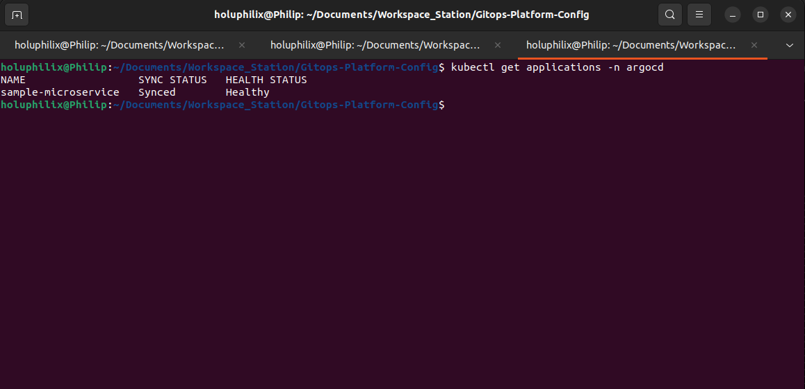
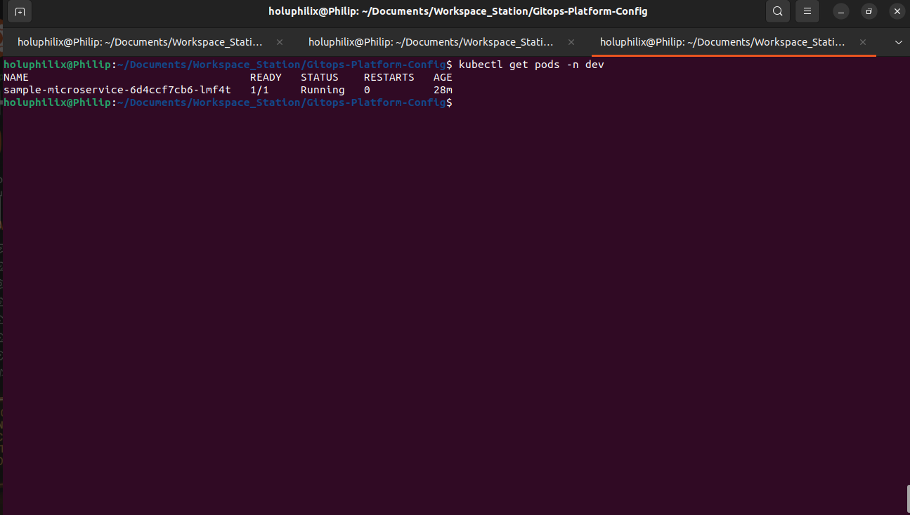
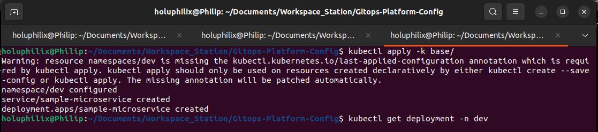
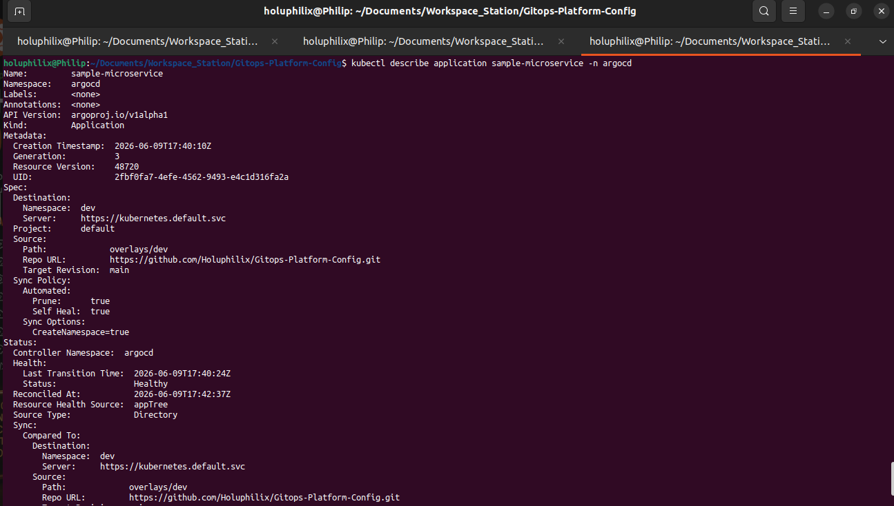

# Task 05 - GitOps Repository Configuration

## Objective

Create the Kubernetes deployment configuration required for GitOps-based application delivery.

This task establishes the declarative Kubernetes manifests, Kustomize environment overlays, and ArgoCD Application configuration used to deploy the sample microservice from Git into the local Kind Kubernetes platform.

## GitOps Configuration Scope

The GitOps configuration includes:

* Kubernetes base manifests
* Kustomize overlays for dev, staging, and prod
* Environment-specific replica settings
* ArgoCD Application definition
* Automated synchronization policy

## Kubernetes Base Manifests

The base manifest layer defines the shared Kubernetes resources that are reused across all environments.

Base manifests created:

* `namespace.yaml`
* `deployment.yaml`
* `service.yaml`
* `kustomization.yaml`

### namespace.yaml

The namespace manifest defines the target application namespace used by the GitOps deployment workflow.

This ensures the workload is deployed into a controlled namespace instead of relying on implicit default namespace behavior.

### deployment.yaml

The deployment manifest defines the sample microservice workload, including the container image reference, container port, labels, and pod template used by Kubernetes to run the application.

This manifest acts as the shared workload definition for all environments.

### service.yaml

The service manifest exposes the sample microservice inside the cluster and provides a stable Kubernetes service endpoint for the running pods.

### kustomization.yaml

The base `kustomization.yaml` file groups the namespace, deployment, and service resources into a reusable Kustomize base.

This allows each environment overlay to inherit the same resource definitions while applying environment-specific changes.

#### Screenshot Evidence: Base Manifest Deployment Running

The base deployment validation confirms that the Kubernetes workload definition can be applied successfully and that the sample microservice reaches a running state.



Caption: Base Kubernetes manifests applied successfully and workload running in the `dev` namespace

## Kustomize Overlays

Kustomize overlays were created to support separate environment configuration while keeping the shared Kubernetes resource definitions in the base layer.

Overlays created:

* `dev`
* `staging`
* `prod`

Each overlay references the shared base and applies the appropriate replica count for that environment.

## Replica Strategy

The replica strategy separates local development, staging validation, and production-style availability concerns.

| Environment | Replica Count | Purpose |
| ----------- | ------------- | ------- |
| dev         | 1             | Lightweight local development and fast validation |
| staging     | 2             | Pre-production validation with basic redundancy |
| prod        | 3             | Production-style availability and rolling update capacity |

The replica counts are managed declaratively through Kustomize overlays so the desired state remains version controlled and reviewable.

#### Screenshot Evidence: Kustomize Overlay Replica Validation

The overlay validation confirms that the `dev`, `staging`, and `prod` overlays render the expected replica counts.



Caption: Kustomize overlays rendering environment-specific replica counts for dev, staging, and prod

## ArgoCD Application Configuration

An ArgoCD Application manifest was created to connect the GitOps configuration repository to the Kubernetes cluster.

The Application configuration defines:

* Source Git repository
* Target path for the Kustomize overlay
* Destination Kubernetes cluster
* Destination namespace
* Automated synchronization policy

The Application uses the `dev` overlay as the deployment target for this phase, allowing ArgoCD to reconcile the sample microservice into the `dev` namespace.

#### Screenshot Evidence: ArgoCD Application Manifest

The ArgoCD Application manifest evidence confirms that the application source, destination, and synchronization settings were declared in Git.



Caption: ArgoCD Application manifest defining the Git source, Kubernetes destination, and automated sync policy

## Automated Synchronization Settings

Automated synchronization was enabled so ArgoCD can continuously reconcile the Kubernetes cluster with the desired state stored in Git.

Automated sync settings configured:

```yaml
syncPolicy:
  automated:
    prune: true
    selfHeal: true
```

The `prune: true` setting allows ArgoCD to remove Kubernetes resources that are no longer present in Git.

The `selfHeal: true` setting allows ArgoCD to correct configuration drift when live cluster resources differ from the desired state in the GitOps repository.

#### Screenshot Evidence: ArgoCD Application Created

The ArgoCD application creation evidence confirms that the Application resource was accepted by Kubernetes and registered with ArgoCD.



Caption: ArgoCD Application resource created successfully for the sample microservice

#### Screenshot Evidence: ArgoCD Managed Workload

The ArgoCD workload evidence confirms that ArgoCD is managing the Kubernetes resources associated with the sample microservice deployment.



Caption: ArgoCD resource tree showing the managed workload created from the GitOps configuration

## Validation

The following validation checks were performed:

* Kustomize overlays render successfully.
* Application deployed successfully.
* ArgoCD sync status is `Synced`.
* ArgoCD health status is `Healthy`.
* Workload is running in the `dev` namespace.

### Kustomize Overlay Render Validation

The Kustomize overlays were rendered and applied successfully, confirming that the base resources and environment overlays are syntactically valid and can produce deployable Kubernetes manifests.

#### Screenshot Evidence: Kustomize Apply Validation

The Kustomize apply evidence confirms that the rendered manifests were accepted by the Kubernetes API server.



Caption: Kustomize overlay rendered and applied successfully to the Kubernetes cluster

### Application Deployment Validation

The sample microservice deployment was created successfully through the GitOps configuration and reached a running state in the target namespace.

Validated namespace:

* `dev`

Validated workload:

* Sample microservice deployment
* Sample microservice service
* Running application pod

### ArgoCD Synchronization and Health Validation

ArgoCD reported the Application sync status as `Synced`, confirming that the live cluster state matches the desired state from Git.

ArgoCD also reported the Application health status as `Healthy`, confirming that the managed Kubernetes resources reached a valid operational state.

#### Screenshot Evidence: ArgoCD Synced and Healthy Status

The ArgoCD dashboard evidence confirms that the Application is synchronized with Git and that the deployed workload is healthy.



Caption: ArgoCD Application status showing `Synced` synchronization state and `Healthy` workload health

## Screenshots

The screenshots embedded above provide operational evidence for base manifest creation, Kustomize overlay rendering, environment-specific replica validation, ArgoCD Application configuration, automated synchronization, successful deployment, Synced status, Healthy status, and the running workload in the `dev` namespace.

## Lessons Learned

Kustomize overlays provide a clean separation between shared Kubernetes resource definitions and environment-specific deployment settings.

ArgoCD automated synchronization with pruning and self-healing creates a reliable GitOps reconciliation loop where Git remains the source of truth for cluster state.
