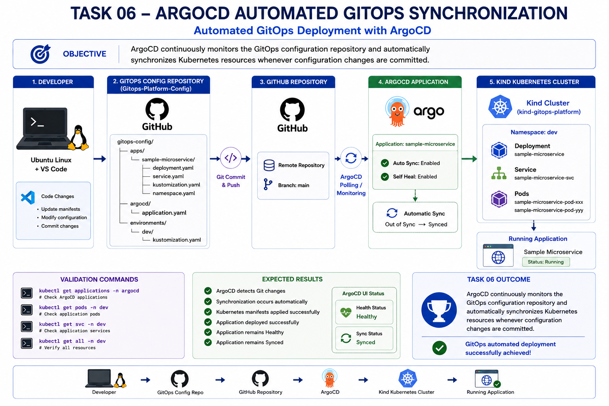
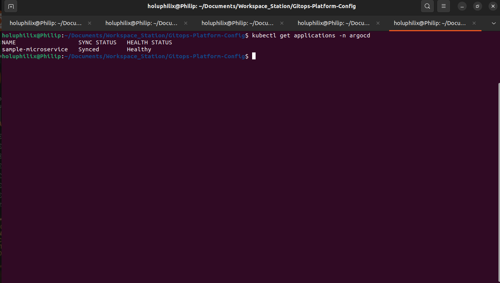
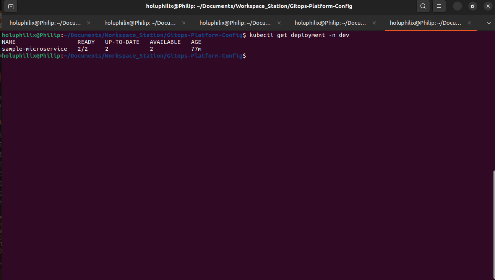
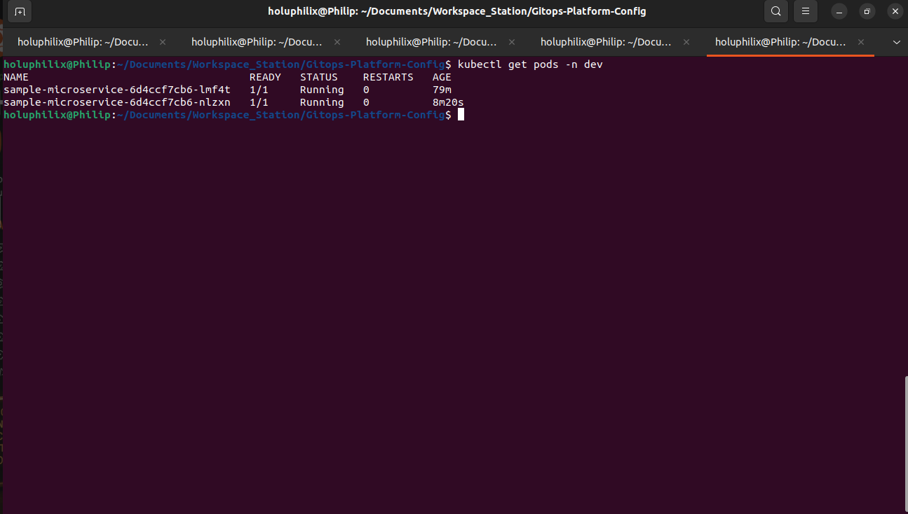

# 🚀 Task 06 - Automated GitOps Deployments

## 🎯 Objective

Validate the automated GitOps deployment workflow by changing the desired state in Git and allowing ArgoCD to synchronize the Kubernetes cluster automatically.

## 📖 Background

This task validated the GitOps reconciliation loop by changing desired state in Git and allowing ArgoCD to apply the change automatically.

## 🏗️ Architecture Diagram



This diagram summarizes the workflow and technical scope for task 06 - automated gitops deployments.

## 📋 Prerequisites

* ArgoCD Application configured.
* GitOps repository connected to ArgoCD.
* Sample microservice running in `dev`.
* Automated sync enabled.

## ⚙️ Implementation Steps

Implementation details are documented in the task-specific sections below.

## GitOps Deployment Validation Process
The validation process used a controlled replica-count change in the `dev` Kustomize overlay.

Validation flow:

1. Modify the desired replica count in the GitOps repository.
2. Commit the change to Git.
3. Push the commit to GitHub.
4. Allow ArgoCD to detect the repository change.
5. Allow ArgoCD to synchronize the application automatically.
6. Validate that Kubernetes scaled the deployment from one replica to two replicas.

This confirms that Git remains the source of truth and that ArgoCD is responsible for applying the desired state to the cluster.

## Replica Patch Change
The `dev` overlay replica patch was updated to increase the sample microservice from one replica to two replicas.

File updated:

```text
overlays/dev/replica-patch.yaml
```

Before:

```yaml
replicas: 1
```

After:

```yaml
replicas: 2
```

This change represents the desired Kubernetes state for the `dev` environment. No direct cluster modification was required.

## Git Commit and Push
After updating `overlays/dev/replica-patch.yaml`, the change was committed and pushed to GitHub.

The Git push made the new desired state available to ArgoCD through the configured GitOps repository source.

Validation purpose:

* Confirms the desired state changed in version control.
* Confirms GitHub received the updated deployment configuration.
* Confirms ArgoCD could detect the change through its repository polling and reconciliation process.

## ArgoCD Automatic Detection and Synchronization
ArgoCD detected the Git repository change and synchronized the Application automatically.

The Application remained in the expected operational state after reconciliation:

* Sync status: `Synced`
* Health status: `Healthy`

This confirms that ArgoCD accepted the updated desired state and reconciled the live cluster resources without requiring a manual `kubectl apply`.

#### Screenshot Evidence: ArgoCD Automatic Synchronization

The ArgoCD validation confirms that the `sample-microservice` Application remained synchronized and healthy after the Git repository change was detected and reconciled.



Caption: ArgoCD Application status showing `Synced` and `Healthy` after automatic GitOps reconciliation

## Kubernetes Deployment Scaling
After ArgoCD synchronized the updated desired state, Kubernetes scaled the deployment from one replica to two replicas.

The deployment validation showed:

* Ready replicas: `2/2`
* Up-to-date replicas: `2`
* Available replicas: `2`

This confirms that the live Kubernetes deployment matched the updated replica target from the GitOps repository.

#### Screenshot Evidence: Deployment Scaled Automatically

The deployment validation confirms that Kubernetes scaled the sample microservice deployment to two ready replicas in the `dev` namespace.



Caption: Kubernetes deployment scaled automatically to `2/2` ready replicas after ArgoCD synchronization

## Pod-Level Runtime Validation
The `dev` namespace was validated after synchronization to confirm that two sample microservice pods were running.

The pod validation showed two running pods with ready container status:

* `1/1 Running`
* `1/1 Running`

This confirms that the deployment scale-up completed successfully at the workload runtime level.

#### Screenshot Evidence: Two Pods Running in Dev

The pod validation confirms that two sample microservice pods are running successfully in the `dev` namespace.



Caption: Two sample microservice pods running in the `dev` namespace after automated GitOps deployment

## ⚙️ Commands Executed

Commands executed are documented below, including the replica patch update, Git commit/push workflow, ArgoCD status validation, deployment validation, and pod validation.

## ✅ Validation

The following validation checks were performed:

* Git commit was successfully pushed to GitHub.
* ArgoCD detected the repository change.
* Application remained `Synced`.
* Application remained `Healthy`.
* Deployment scaled automatically from one replica to two replicas.
* Two pods were running in the `dev` namespace.
* No manual `kubectl apply` was executed for the replica change.

### Git Push Validation

The replica-count change was committed and pushed to GitHub, making the updated desired state available to ArgoCD through the configured repository source.

This proves that the deployment change originated from Git rather than from a direct Kubernetes API operation.

### ArgoCD Reconciliation Validation

ArgoCD detected the Git repository update and reconciled the Application automatically.

The Application status remained `Synced` and `Healthy`, confirming that the live cluster state matched the desired state after synchronization.

### Kubernetes Scaling Validation

Kubernetes reflected the updated desired state by scaling the sample microservice deployment to two replicas.

The deployment reached `2/2` ready replicas, and pod validation confirmed two running pods in the `dev` namespace.

### Manual Apply Exclusion

No manual `kubectl apply` command was executed for this deployment change.

The only configuration change was made in the GitOps repository and delivered through the ArgoCD automated synchronization workflow.

## 📸 Screenshots

### Task 06 Argocd Auto Sync


Caption: Task 06 automated ArgoCD synchronization and Kubernetes scaling validation evidence.

### Task 06 Deployment Scaled


Caption: Task 06 automated ArgoCD synchronization and Kubernetes scaling validation evidence.

### Task 06 Two Replicas Running


Caption: Task 06 automated ArgoCD synchronization and Kubernetes scaling validation evidence.

## 🎉 Key Outcomes

ArgoCD automatically synchronized the Git change and Kubernetes scaled the dev deployment from one replica to two replicas.

## 📚 Lessons Learned

Automated GitOps deployments provide a clear separation between declaring desired state in Git and applying that state to Kubernetes.

ArgoCD keeps the cluster aligned with the GitOps repository, enabling controlled deployment changes without direct manual application of Kubernetes manifests.

## 🏁 Conclusion

The Task 06 - Automated GitOps Deployments phase is complete and validated with documented operational evidence.
