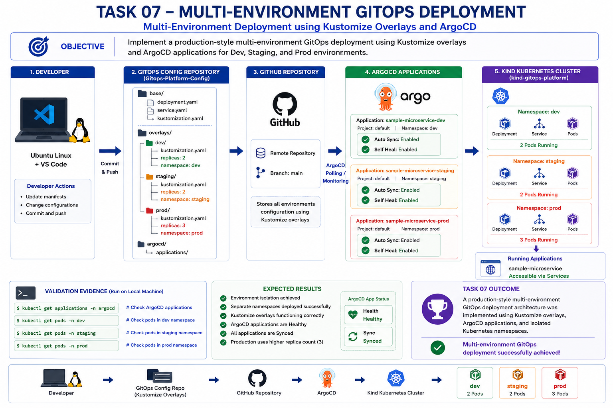
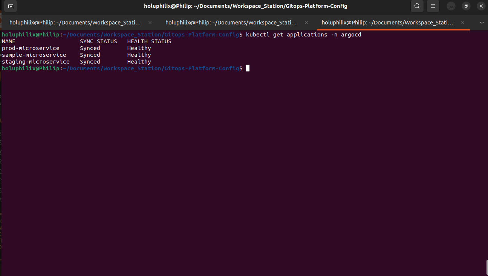
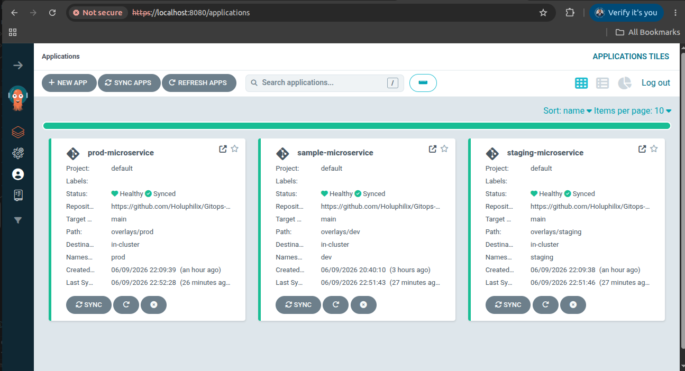
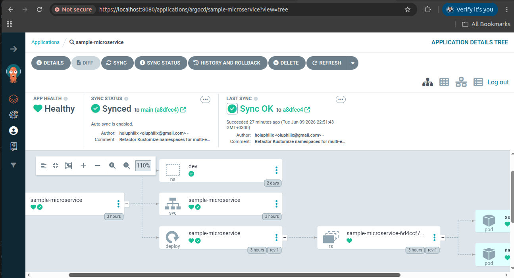
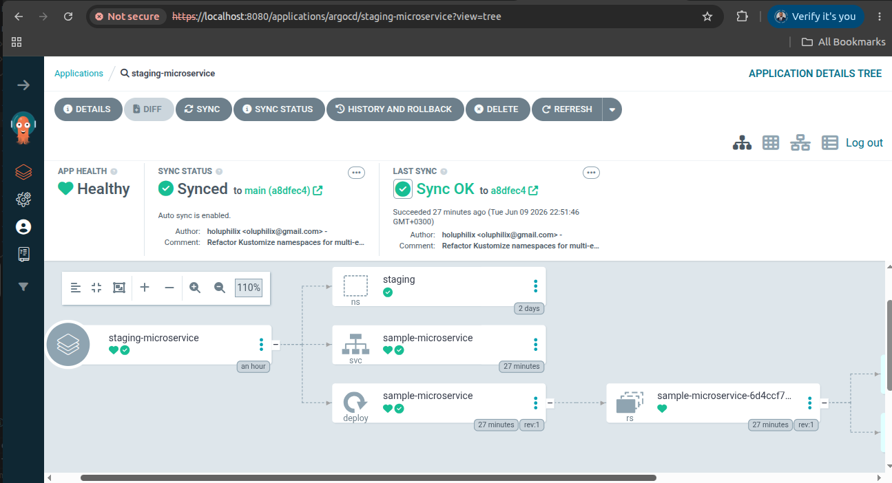
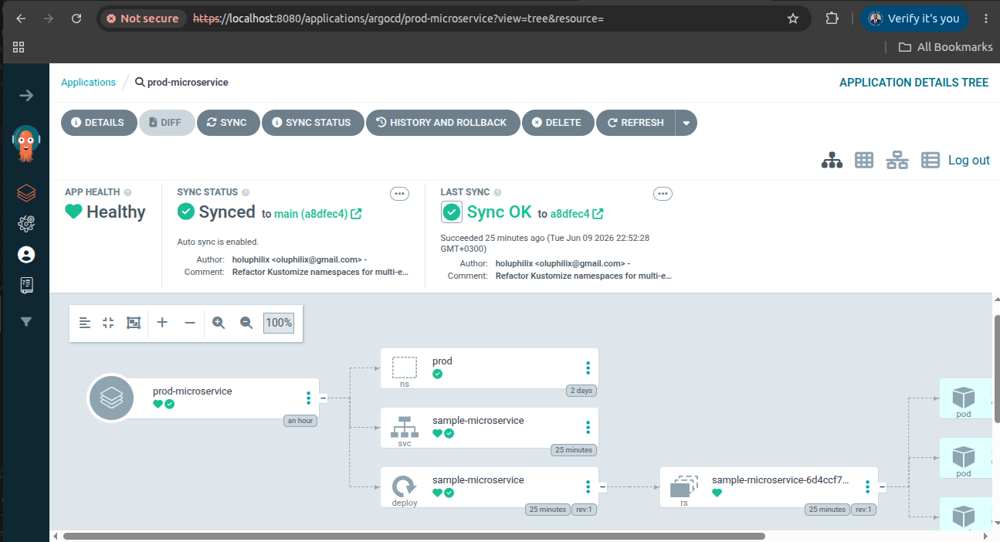
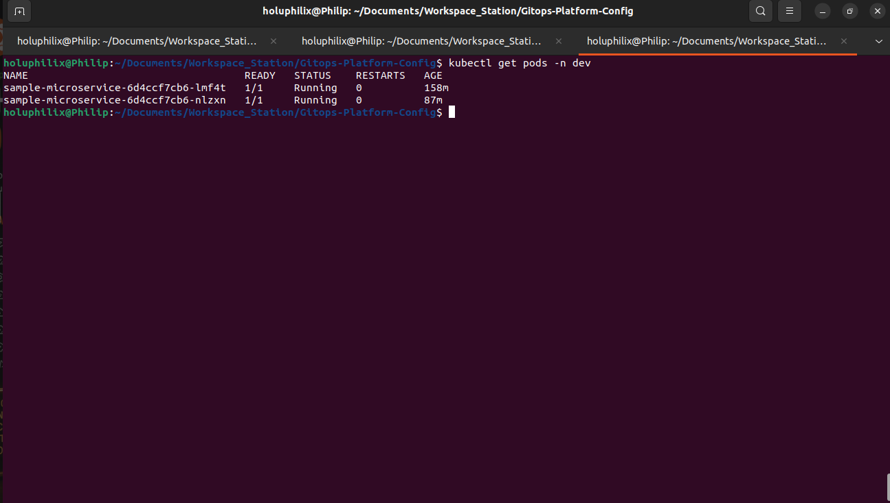
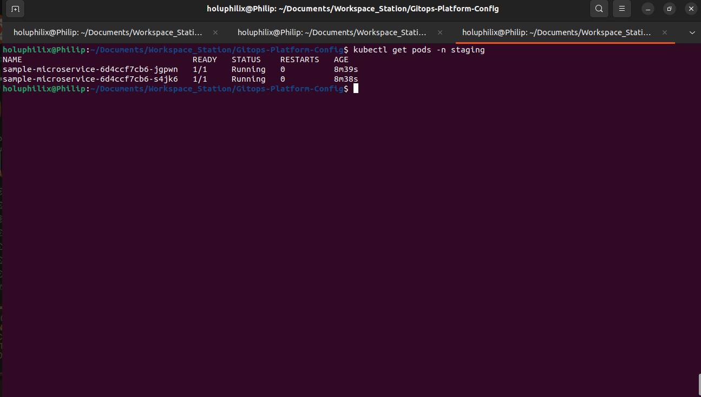
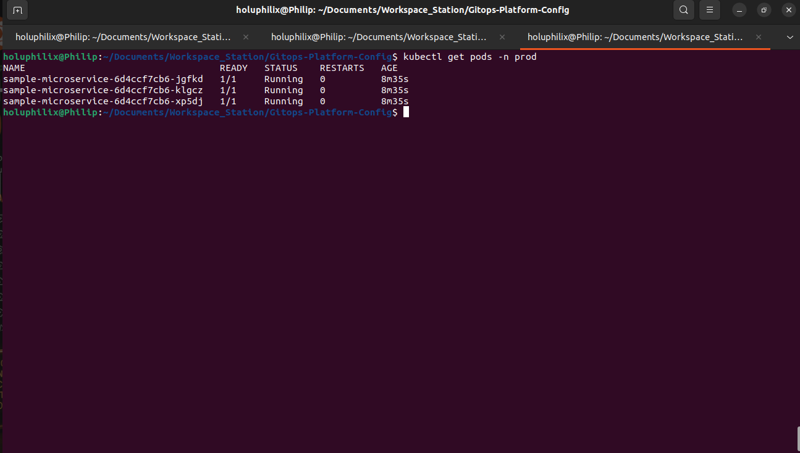

# 🚀 Task 07 - Multi-Environment Management

## 🎯 Objective

Implement and validate multi-environment GitOps deployments using Kustomize, ArgoCD, and Kubernetes.

## 📖 Background

This task expanded the GitOps platform from a single deployment target to independent `dev`, `staging`, and `prod` environments.

## 🏗️ Architecture Diagram

This diagram summarizes the workflow and technical scope for task 07 - multi-environment management.

## 📋 Prerequisites

* Kustomize base manifests available.
* ArgoCD installed and configured.
* `dev`, `staging`, and `prod` namespaces available.
* GitOps repository connected to ArgoCD.

## ⚙️ Implementation Steps

Implementation details are documented in the task-specific sections below.

## Multi-Environment GitOps Strategy
The multi-environment deployment model uses:

* Kustomize for base and overlay configuration management
* ArgoCD for automated GitOps synchronization
* Kubernetes namespaces for environment isolation

Each environment has its own Kustomize overlay and ArgoCD Application, allowing the same application base configuration to be deployed with environment-specific settings.

## Environment Deployments
Three environments were created and deployed:

* `dev`
* `staging`
* `prod`

Each environment is deployed into its own Kubernetes namespace and managed by a dedicated ArgoCD Application.

## Namespace Refactor
The Kustomize configuration was refactored to remove hardcoded namespace ownership from the base layer.

Refactor completed:

* Removed hardcoded namespace configuration from the base layer.
* Moved namespace ownership into environment overlays.
* Made the base Kustomize configuration environment-agnostic.

This change allows the same base manifests to be reused safely across `dev`, `staging`, and `prod` without forcing all environments into a single namespace.

The base layer now defines shared application resources, while each overlay controls the namespace and environment-specific deployment behavior.

## Environment-Specific Replica Counts
Replica counts were configured independently for each environment.

| Environment | Replica Count | Purpose |
| ----------- | ------------- | ------- |
| dev         | 2             | Development validation with two running pods |
| staging     | 2             | Pre-production validation with matching dev redundancy |
| prod        | 3             | Production-style availability with additional capacity |

These replica counts are enforced through Kustomize overlays and reconciled into Kubernetes by ArgoCD.

## ArgoCD Application Deployment
Dedicated ArgoCD Applications were created for each environment:

* `sample-microservice`
* `staging-microservice`
* `prod-microservice`

Each Application points to the appropriate Kustomize overlay path and deploys into the matching Kubernetes namespace.

ArgoCD continuously monitors the GitOps repository and reconciles all three environments to the desired state stored in Git.

#### Screenshot Evidence: Multi-Environment ArgoCD Applications

The ArgoCD validation confirms that all environment Applications were created successfully and reached `Synced` and `Healthy` status.

Caption: ArgoCD Applications for dev, staging, and prod showing `Synced` synchronization state and `Healthy` workload status

## ArgoCD Multi-Environment Visualization
The ArgoCD dashboard provides a visual view of the multi-environment GitOps deployment model.

From a single GitOps repository, ArgoCD manages independent Applications for `dev`, `staging`, and `prod`. Each Application tracks its own Kustomize overlay, deploys into its own Kubernetes namespace, and reconciles its own workload resources while still following the same shared base configuration.

#### Screenshot Evidence: ArgoCD Multi-Environment Dashboard

The ArgoCD dashboard confirms that the dev, staging, and production Applications are managed independently while remaining synchronized from the same GitOps repository.

Caption: ArgoCD dashboard showing independent dev, staging, and production Applications with `Healthy` and `Synced` status

#### Screenshot Evidence: Dev Application Topology

The dev topology view shows the resource tree for the `sample-microservice` Application, including the `dev` namespace, service, deployment, replica set, and running pods.

Caption: ArgoCD topology for the dev Application showing Kubernetes resources reconciled from the dev overlay

#### Screenshot Evidence: Staging Application Topology

The staging topology view shows the `staging-microservice` Application managing its own namespace-scoped resources independently from dev and production.

Caption: ArgoCD topology for the staging Application showing environment-specific resources managed from the staging overlay

#### Screenshot Evidence: Production Application Topology

The production topology view shows the `prod-microservice` Application managing the production namespace resources, including the production deployment path from Git to Kubernetes.

Caption: ArgoCD topology for the production Application showing the prod namespace, service, deployment, replica set, and pods managed through GitOps

## Dev Environment Deployment
The `dev` environment was deployed through its Kustomize overlay into the `dev` namespace.

The dev overlay enforces:

* Namespace: `dev`
* Replica count: `2`

#### Screenshot Evidence: Dev Environment Pods

The dev namespace validation confirms that the environment deployed successfully and that two sample microservice pods are running.

Caption: Dev namespace running two ready sample microservice pods from the environment-specific Kustomize overlay

## Staging Environment Deployment
The `staging` environment was deployed through its Kustomize overlay into the `staging` namespace.

The staging overlay enforces:

* Namespace: `staging`
* Replica count: `2`

#### Screenshot Evidence: Staging Environment Pods

The staging namespace validation confirms that the environment deployed successfully and that two sample microservice pods are running.

Caption: Staging namespace running two ready sample microservice pods from the staging Kustomize overlay

## Production Environment Deployment
The `prod` environment was deployed through its Kustomize overlay into the `prod` namespace.

The prod overlay enforces:

* Namespace: `prod`
* Replica count: `3`

#### Screenshot Evidence: Production Environment Pods

The production namespace validation confirms that the environment deployed successfully and that three sample microservice pods are running.

Caption: Production namespace running three ready sample microservice pods from the production Kustomize overlay

## ⚙️ Commands Executed

Commands executed are reflected in the validation evidence below, including ArgoCD Application checks and namespace-specific pod validation.

## ✅ Validation

The following validation checks were performed:

* ArgoCD Applications were successfully created.
* All Applications reached `Synced` status.
* All Applications reached `Healthy` status.
* Dev namespace deployed successfully.
* Staging namespace deployed successfully.
* Production namespace deployed successfully.
* Environment-specific replica counts were enforced.
* GitOps synchronization worked across all environments.

### ArgoCD Application Validation

The ArgoCD Application list confirmed that the dev, staging, and prod Applications were present in the `argocd` namespace.

All Applications reported `Synced` and `Healthy`, proving that ArgoCD reconciled each environment successfully from the GitOps repository.

### Namespace Deployment Validation

Each environment namespace was validated independently:

| Namespace | Expected Pods | Validation Result |
| --------- | ------------- | ----------------- |
| dev       | 2             | 2 running pods |
| staging   | 2             | 2 running pods |
| prod      | 3             | 3 running pods |

This proves that each overlay deployed into the correct namespace and that the namespace refactor allowed the base Kustomize configuration to remain reusable across environments.

### Replica Enforcement Validation

The observed pod counts matched the configured replica counts:

* `dev = 2`
* `staging = 2`
* `prod = 3`

This confirms that environment-specific Kustomize overlays controlled the desired replica state for each deployment.

### GitOps Synchronization Validation

The synchronized and healthy ArgoCD Applications confirm that GitOps synchronization worked across all environments.

ArgoCD reconciled the environment overlays into Kubernetes without requiring environment-specific manual deployment commands.

## 📸 Screenshots

### Task 07 Argocd Multi Environment Applications

Caption: Task 07 multi-environment ArgoCD, topology, and namespace pod validation evidence.

### Task 07 Argocd Multi Environment Dashboard

Caption: Task 07 multi-environment ArgoCD, topology, and namespace pod validation evidence.

### Task 07 Dev Application Topology

Caption: Task 07 multi-environment ArgoCD, topology, and namespace pod validation evidence.

### Task 07 Dev Environment Pods

Caption: Task 07 multi-environment ArgoCD, topology, and namespace pod validation evidence.

### Task 07 Staging Application Topology

Caption: Task 07 multi-environment ArgoCD, topology, and namespace pod validation evidence.

### Task 07 Staging Environment Pods

Caption: Task 07 multi-environment ArgoCD, topology, and namespace pod validation evidence.

### Task 07 Production Application Topology

Caption: Task 07 multi-environment ArgoCD, topology, and namespace pod validation evidence.

### Task 07 Production Environment Pods

Caption: Task 07 multi-environment ArgoCD, topology, and namespace pod validation evidence.

## 🎉 Key Outcomes

Multi-environment GitOps deployment was completed across dev, staging, and production namespaces with enforced replica counts.

## 📚 Lessons Learned

Keeping the Kustomize base environment-agnostic makes the configuration reusable and easier to promote across environments.

Moving namespace ownership into overlays provides cleaner separation between shared application resources and environment-specific deployment concerns.

## 🏁 Conclusion

The Task 07 - Multi-Environment Management phase is complete and validated with documented operational evidence.
