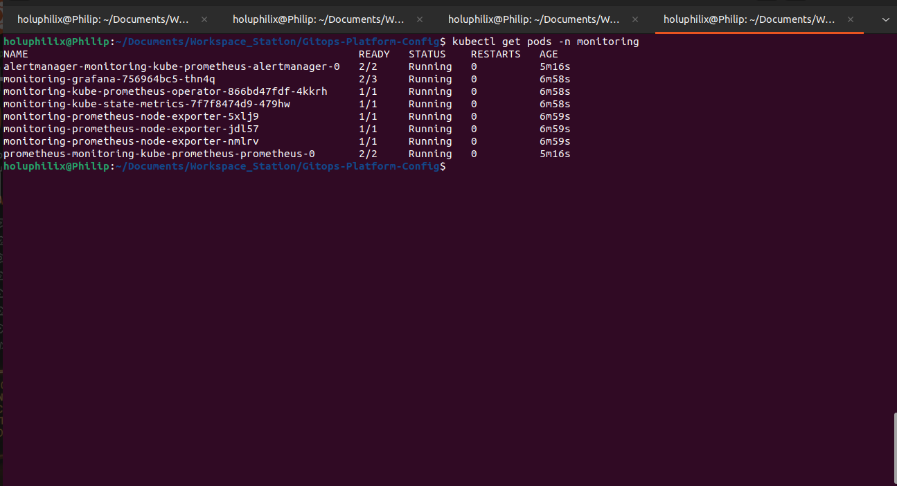
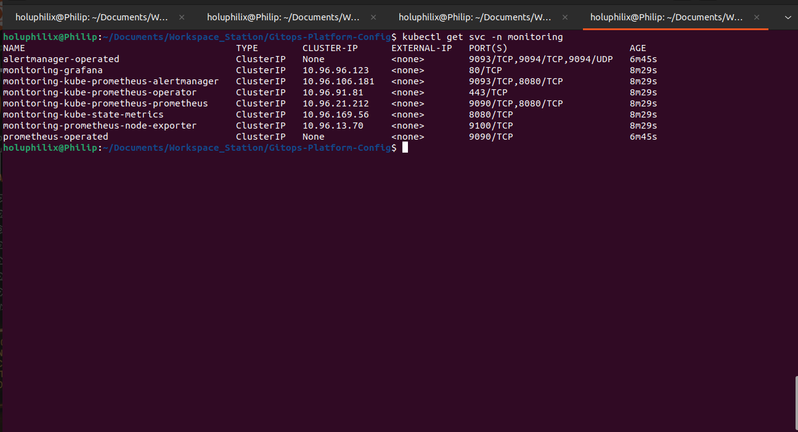
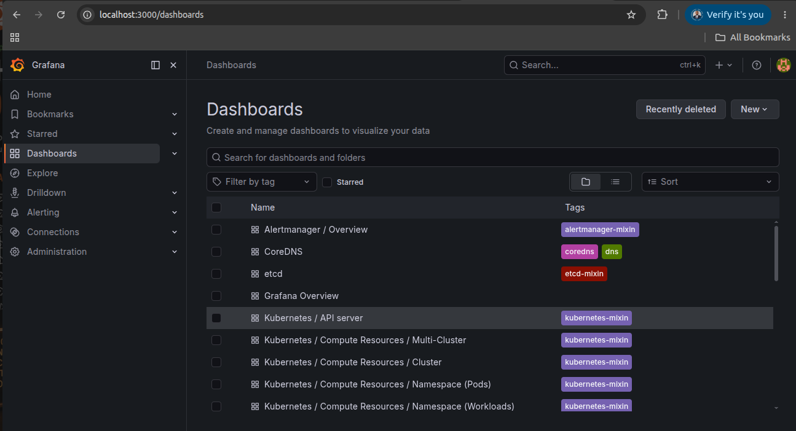
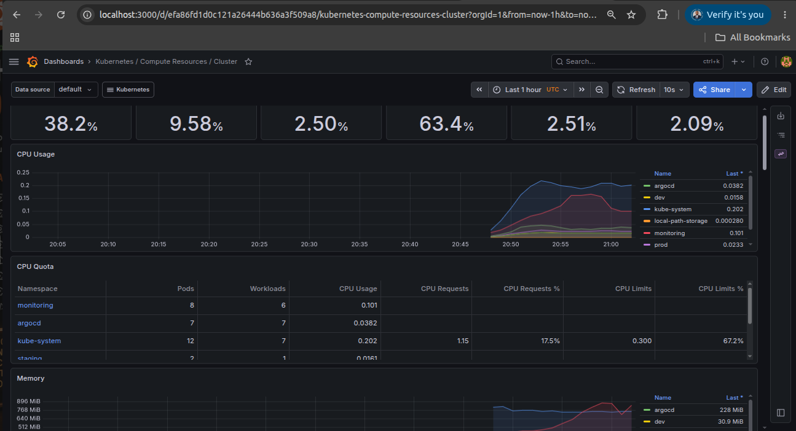
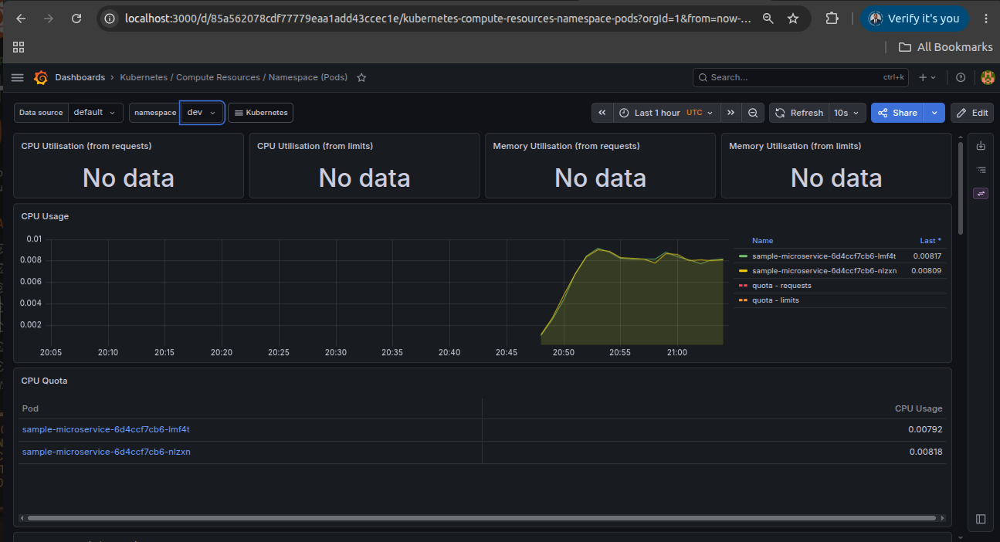
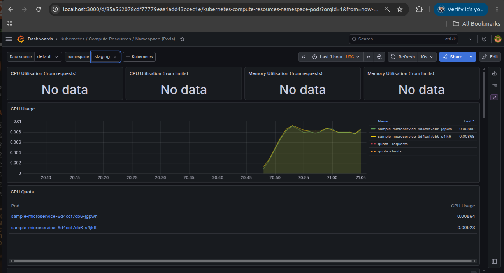
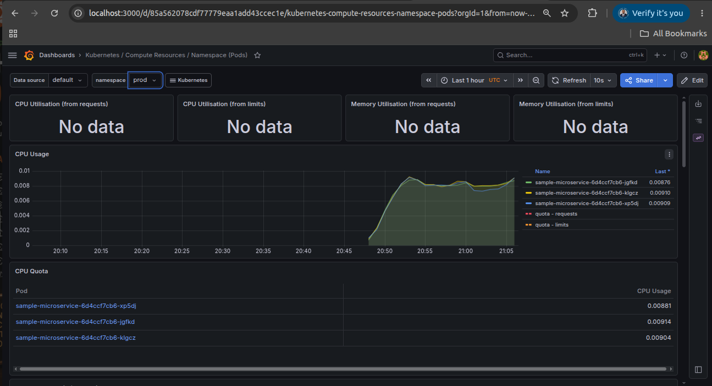
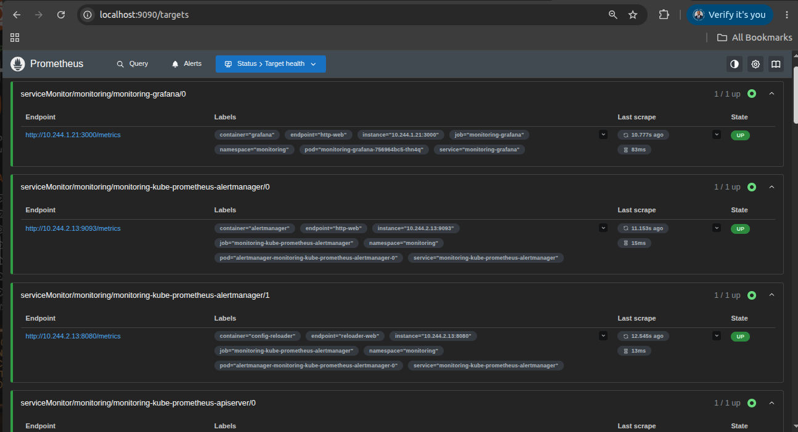
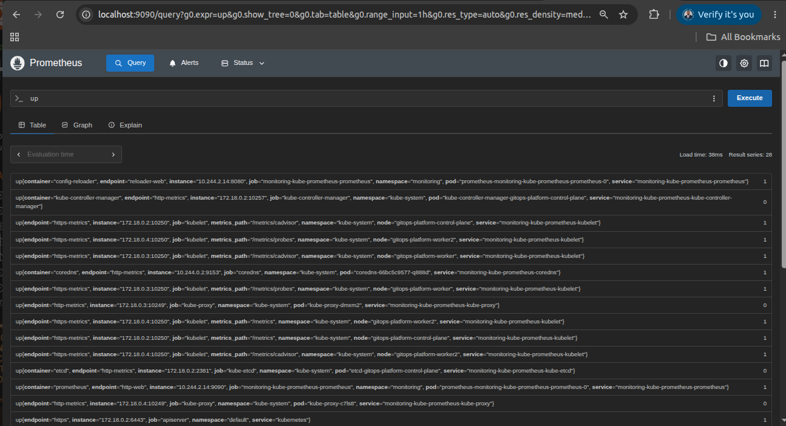

# Task 08 - Monitoring and Observability

## Objective

Implement a Kubernetes monitoring and observability stack using Helm and the `kube-prometheus-stack` chart.

This task adds platform-level visibility for the Kind Kubernetes cluster, ArgoCD-managed application namespaces, and core monitoring components using Prometheus, Grafana, Alertmanager, Node Exporter, Kube State Metrics, and the Prometheus Operator.

## Monitoring Stack Components

The monitoring stack was implemented with the Prometheus Community Helm chart for `kube-prometheus-stack`.

Implemented components:

* Helm
* kube-prometheus-stack
* Prometheus
* Grafana
* Alertmanager
* Node Exporter
* Kube State Metrics
* Prometheus Operator

## Why kube-prometheus-stack?

The `kube-prometheus-stack` chart provides a production-style monitoring foundation for Kubernetes.

It packages Prometheus, Grafana, Alertmanager, exporters, dashboards, service discovery, and the Prometheus Operator into a repeatable Helm-based installation.

This approach provides:

* Kubernetes-native metrics collection
* Preconfigured Grafana dashboards
* Prometheus target discovery
* Alertmanager integration
* Node-level metrics through Node Exporter
* Kubernetes object metrics through Kube State Metrics
* Operator-managed Prometheus resources

## Implementation Steps

### Step 1: Create Monitoring Namespace

A dedicated namespace was used to isolate monitoring workloads from platform and application workloads.

Command used:

```bash
kubectl create namespace monitoring
```

Validation command:

```bash
kubectl get namespace monitoring
```

The `monitoring` namespace was available before installing the Helm chart.

### Step 2: Configure Helm Repository

The Prometheus Community Helm repository was added and updated so the `kube-prometheus-stack` chart could be installed.

Commands used:

```bash
helm repo add prometheus-community https://prometheus-community.github.io/helm-charts
helm repo update
```

This prepared Helm to install the monitoring stack from the official community chart repository.

### Step 3: Install kube-prometheus-stack

The monitoring stack was installed into the `monitoring` namespace using Helm.

Command used:

```bash
helm install monitoring prometheus-community/kube-prometheus-stack \
  --namespace monitoring
```

The Helm release deployed Prometheus, Grafana, Alertmanager, Node Exporter, Kube State Metrics, and the Prometheus Operator.

### Step 4: Validate Monitoring Pods

The monitoring namespace was validated to confirm that all core pods reached the `Running` state.

Validation command:

```bash
kubectl get pods -n monitoring
```

Validated workloads included:

* Alertmanager
* Grafana
* Prometheus
* Prometheus Operator
* Kube State Metrics
* Node Exporter

#### Screenshot Evidence: Monitoring Stack Pods

The pod validation confirms that the monitoring stack components are running successfully in the `monitoring` namespace.



Caption: Monitoring namespace pods showing Prometheus, Grafana, Alertmanager, Node Exporter, Kube State Metrics, and Prometheus Operator running successfully

### Step 5: Validate Monitoring Services

The monitoring services were validated to confirm that the deployed components exposed the expected in-cluster service endpoints.

Validation command:

```bash
kubectl get svc -n monitoring
```

Validated services included:

* `monitoring-grafana`
* `monitoring-kube-prometheus-prometheus`
* `monitoring-kube-prometheus-alertmanager`
* `monitoring-kube-state-metrics`
* `monitoring-prometheus-node-exporter`
* `prometheus-operated`
* `alertmanager-operated`

#### Screenshot Evidence: Monitoring Stack Services

The service validation confirms that the monitoring stack exposed the required Kubernetes services for Grafana, Prometheus, Alertmanager, exporters, and operator-managed endpoints.



Caption: Monitoring namespace services exposing Grafana, Prometheus, Alertmanager, Kube State Metrics, Node Exporter, and operated endpoints

## Grafana Access and Dashboard Verification

Grafana was accessed locally using Kubernetes port forwarding.

Command used:

```bash
kubectl port-forward svc/monitoring-grafana -n monitoring 3000:80
```

Access URL:

```text
http://localhost:3000
```

Grafana dashboard validation confirmed that Kubernetes dashboards were available and that cluster and namespace metrics were visible.

#### Screenshot Evidence: Grafana Dashboard Home

The Grafana dashboard home confirms that the kube-prometheus-stack installation loaded Kubernetes and platform dashboards successfully.



Caption: Grafana dashboards page showing imported Kubernetes, Alertmanager, CoreDNS, etcd, and compute resource dashboards

#### Screenshot Evidence: Grafana Cluster Overview

The cluster overview dashboard confirms that Kubernetes cluster metrics were available in Grafana.



Caption: Grafana Kubernetes cluster overview showing CPU, memory, namespace, pod, and workload metrics collected from Prometheus

## Namespace Metrics Validation

Namespace-level Grafana dashboards were validated for the application environments created in the previous GitOps phases.

Validated namespaces:

* `dev`
* `staging`
* `prod`

These dashboards confirm that Prometheus collected workload metrics from each application namespace and that Grafana could visualize per-namespace pod activity.

#### Screenshot Evidence: Dev Namespace Metrics

The dev namespace dashboard confirms that Grafana can display pod-level metrics for the `dev` environment.



Caption: Grafana namespace dashboard showing CPU metrics for sample microservice pods in the `dev` namespace

#### Screenshot Evidence: Staging Namespace Metrics

The staging namespace dashboard confirms that Grafana can display pod-level metrics for the `staging` environment.



Caption: Grafana namespace dashboard showing CPU metrics for sample microservice pods in the `staging` namespace

#### Screenshot Evidence: Production Namespace Metrics

The production namespace dashboard confirms that Grafana can display pod-level metrics for the `prod` environment.



Caption: Grafana namespace dashboard showing CPU metrics for sample microservice pods in the `prod` namespace

## Prometheus Validation

Prometheus was accessed locally using Kubernetes port forwarding.

Command used:

```bash
kubectl port-forward svc/monitoring-kube-prometheus-prometheus -n monitoring 9090:9090
```

Access URL:

```text
http://localhost:9090
```

Prometheus validation was performed using:

* Prometheus Targets
* `up` query results

### Prometheus Targets

The Prometheus Targets page was used to confirm that service monitors and scrape targets were discovered and reachable.

#### Screenshot Evidence: Prometheus Targets

The Prometheus targets validation confirms that monitoring targets were discovered and reporting an `UP` state.



Caption: Prometheus targets page showing discovered monitoring targets with successful scrape status

### up Query Results

The `up` query was executed in Prometheus to validate scrape health and confirm that Prometheus was collecting target availability metrics.

Query used:

```promql
up
```

#### Screenshot Evidence: Prometheus up Query Results

The query validation confirms that Prometheus returned target availability metrics for cluster and monitoring components.



Caption: Prometheus `up` query results showing scrape health data for Kubernetes and monitoring targets

## Validation

The following validation checks were performed:

* Monitoring namespace created successfully.
* Prometheus deployed successfully.
* Grafana deployed successfully.
* Alertmanager deployed successfully.
* Node Exporters deployed successfully.
* Kube State Metrics deployed successfully.
* Prometheus Operator deployed successfully.
* Prometheus targets were reachable.
* Kubernetes cluster metrics were visible.
* Namespace metrics were visible.
* Monitoring stack was operational.

### Namespace Validation

The `monitoring` namespace was created successfully and used as the deployment target for all monitoring resources.

### Component Validation

The monitoring pod validation confirmed that Prometheus, Grafana, Alertmanager, Node Exporter, Kube State Metrics, and Prometheus Operator were running in the `monitoring` namespace.

### Service Validation

The service validation confirmed that Grafana, Prometheus, Alertmanager, exporter, and operator-managed service endpoints were available in Kubernetes.

### Grafana Validation

Grafana was accessed successfully through local port forwarding, and Kubernetes dashboards were available for cluster and namespace-level observability.

Cluster-level metrics and namespace-specific metrics were visible for `dev`, `staging`, and `prod`.

### Prometheus Validation

Prometheus was accessed successfully through local port forwarding.

The Targets page confirmed that monitoring targets were discoverable and reachable, and the `up` query returned target availability metrics.

## Screenshots

The screenshots embedded above provide operational evidence for monitoring namespace workloads, monitoring services, Grafana dashboard access, cluster metrics, namespace metrics, Prometheus target health, and Prometheus query validation.

## Lessons Learned

The `kube-prometheus-stack` chart provides a complete Kubernetes observability baseline with minimal manual configuration.

Combining Prometheus target validation with Grafana dashboard checks gives both raw metric verification and practical visual confirmation that the platform is observable.
