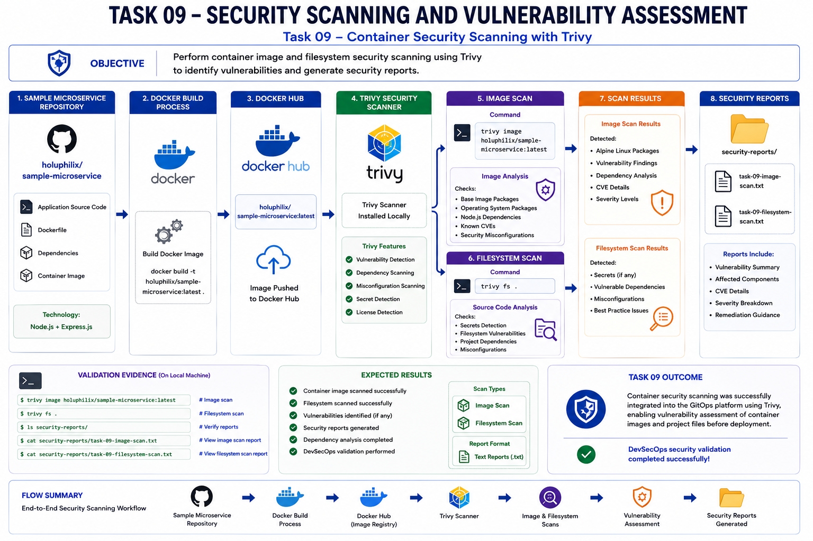
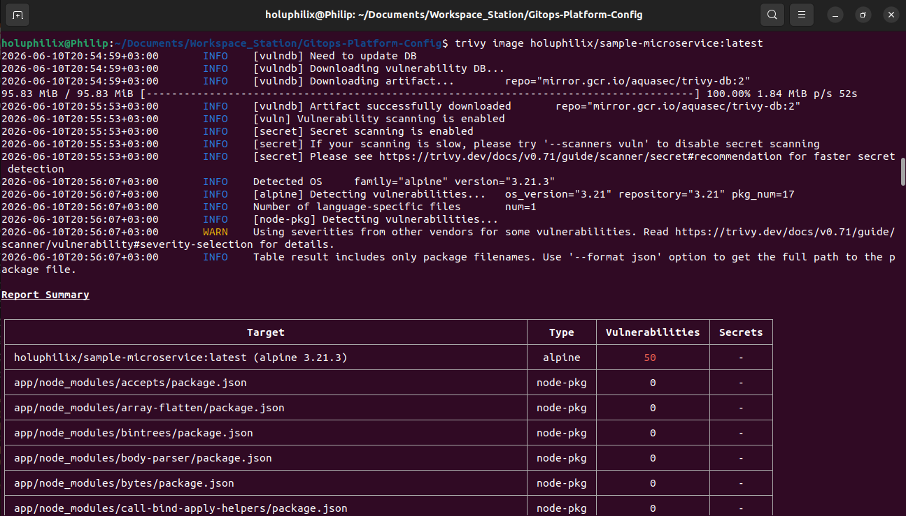
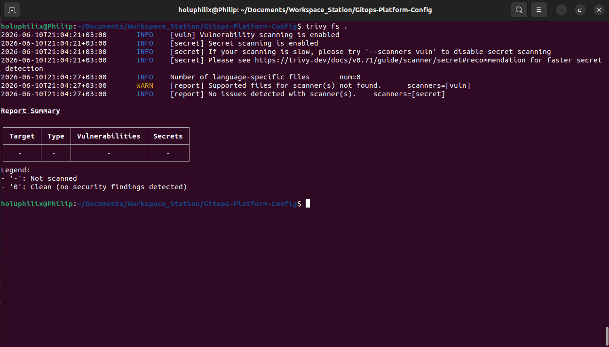
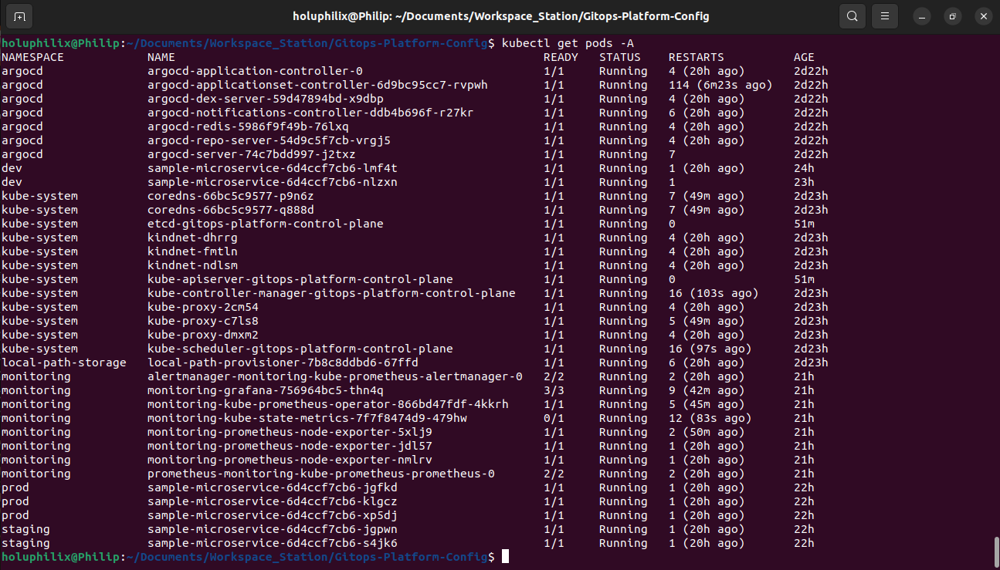
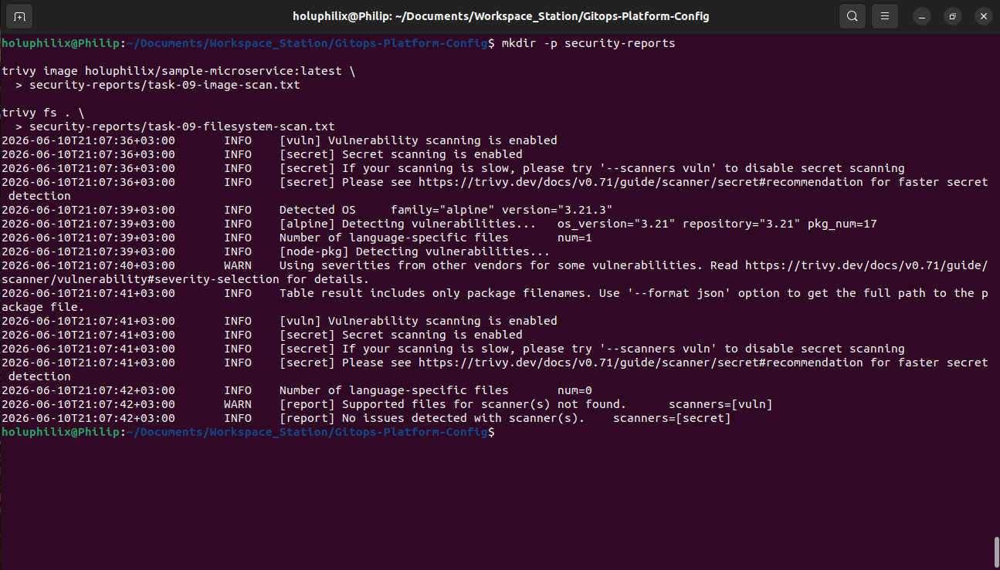

# 🚀 Task 09 - Security Scanning and Compliance

## 🎯 Objective

Implement and validate security scanning for the GitOps platform using Trivy.

This task verifies local security scanning capabilities for container images, repository filesystem content, Kubernetes platform workloads, and exported security reports that can be reviewed as operational evidence.

## 📖 Background

Security scanning was added to validate container image risk, repository filesystem content, live cluster context, and report export evidence.

## 🏗️ Architecture Diagram



This diagram summarizes the workflow and technical scope for task 09 - security scanning and compliance.

## 📋 Prerequisites

The following prerequisites were required before completing this task:

* Trivy installed locally.
* Docker image available as `holuphilix/sample-microservice:latest`.
* Kind Kubernetes cluster running.
* ArgoCD-managed workloads deployed across `dev`, `staging`, and `prod`.
* Monitoring stack deployed in the `monitoring` namespace.
* Repository available locally for filesystem scanning and report export.

## ⚙️ Implementation Steps

### Step 1: Verify Trivy Installation

Trivy installation was validated before running security scans.

Command used:

```bash
trivy --version
```

Result:

```text
Version: 0.71.0
```

This confirmed that Trivy was installed and available for container image, filesystem, and Kubernetes security scanning.

### Step 2: Attempt Kubernetes Security Scan

A Kubernetes security scan was attempted against the local Kind cluster.

Command used:

```bash
trivy k8s kind-gitops-platform --report summary
```

Result:

```text
runner received timeout
```

Trivy successfully connected to the Kubernetes cluster, but the node-collector job timed out while running in the local Kind lab environment.

This was documented as a limitation of the local Kubernetes setup rather than a failure of the wider security validation workflow. Local Kind clusters can be constrained by container runtime behavior, node access limitations, and resource availability, which may affect Trivy Kubernetes node collection.

### Step 3: Run Container Image Security Scan

The sample microservice container image was scanned with Trivy.

Command used:

```bash
trivy image holuphilix/sample-microservice:latest
```

Result:

* Alpine Linux 3.21.3 detected.
* Node.js packages scanned.
* Vulnerability report generated.
* Security findings identified in the base image.

The scan confirmed that Trivy could inspect both the container base operating system and application package metadata.

#### Screenshot Evidence: Trivy Container Image Scan

The image scan evidence confirms that Trivy inspected the sample microservice image, detected Alpine Linux 3.21.3, scanned Node.js packages, and produced a vulnerability summary.



Caption: Trivy image scan showing Alpine Linux 3.21.3 detection, Node.js package scanning, and base image vulnerability findings

### Step 4: Run Filesystem Security Scan

The local repository filesystem was scanned with Trivy.

Command used:

```bash
trivy fs .
```

Result:

* Repository scanned successfully.
* No secrets detected.
* No filesystem findings reported.

This validation confirmed that the repository content did not contain Trivy-detected filesystem vulnerabilities or secrets at the time of scanning.

#### Screenshot Evidence: Trivy Filesystem Scan

The filesystem scan evidence confirms that Trivy completed repository scanning and reported no issues for the enabled scanners.



Caption: Trivy filesystem scan showing successful repository scanning with no secrets or filesystem findings reported

### Step 5: Validate Kubernetes Platform Workloads

The Kubernetes platform was validated to confirm that workloads were running across the platform, monitoring, and application namespaces before completing security documentation.

Command used:

```bash
kubectl get pods -A
```

Result:

Validated running workloads across:

* `argocd`
* `monitoring`
* `dev`
* `staging`
* `prod`
* `kube-system`

#### Screenshot Evidence: Kubernetes Platform Validation

The Kubernetes validation evidence confirms that platform, monitoring, and application workloads were running across the expected namespaces.



Caption: Kubernetes pod validation showing running workloads across ArgoCD, monitoring, application, and system namespaces

### Step 6: Export Security Reports

Security scan output was exported into local report files for review and documentation.

Commands used:

```bash
mkdir -p security-reports
trivy image holuphilix/sample-microservice:latest > security-reports/task-09-image-scan.txt
trivy fs . > security-reports/task-09-filesystem-scan.txt
```

Generated reports:

* `security-reports/task-09-image-scan.txt`
* `security-reports/task-09-filesystem-scan.txt`

This created persistent security evidence that can be reviewed outside the terminal session.

#### Screenshot Evidence: Security Report Export

The report export evidence confirms that image and filesystem scan results were written to the `security-reports` directory.



Caption: Trivy image and filesystem scan output exported into task-specific security report files

## Task Summary
Task 09 completed security scanning validation for the GitOps platform.

Completed work:

* Verified Trivy installation.
* Attempted Kubernetes security scanning and documented the local Kind timeout limitation.
* Scanned the sample microservice container image.
* Scanned the repository filesystem.
* Validated Kubernetes workloads across platform and application namespaces.
* Exported image and filesystem scan reports.
* Captured screenshot evidence for security validation.

## ⚙️ Commands Executed

The following commands were executed during Task 09:

```bash
trivy --version
trivy k8s kind-gitops-platform --report summary
trivy image holuphilix/sample-microservice:latest
trivy fs .
kubectl get pods -A
mkdir -p security-reports
trivy image holuphilix/sample-microservice:latest > security-reports/task-09-image-scan.txt
trivy fs . > security-reports/task-09-filesystem-scan.txt
```

## ✅ Validation

The following validation checks were performed:

* Trivy installation verified successfully.
* Trivy version confirmed as `0.71.0`.
* Kubernetes security scan attempted against the local Kind cluster.
* Kubernetes scan limitation documented due to node-collector timeout.
* Container image scan completed successfully.
* Alpine Linux 3.21.3 base image detected.
* Node.js packages scanned successfully.
* Image vulnerability report generated.
* Filesystem scan completed successfully.
* No secrets detected in the repository filesystem scan.
* No filesystem findings reported.
* Kubernetes workloads validated across platform and application namespaces.
* Security reports exported successfully.

### Trivy Installation Validation

The `trivy --version` command confirmed that Trivy `0.71.0` was installed and available for local security scanning.

### Kubernetes Security Scan Validation

The Kubernetes scan connected to the local Kind cluster, but the node-collector job timed out with `runner received timeout`.

This limitation was documented because local Kind environments may not fully support all node-level collection behavior expected by Kubernetes security scanners.

### Container Image Scan Validation

The container image scan validated the sample microservice image and identified security findings in the Alpine base image layer.

This confirms that image vulnerability scanning is available for the application delivery workflow.

### Filesystem Scan Validation

The filesystem scan completed successfully and reported no secrets or filesystem findings.

This confirms that repository-level scanning can be used as part of the GitOps security validation process.

### Platform Workload Validation

The `kubectl get pods -A` validation confirmed that Kubernetes workloads were running across ArgoCD, monitoring, application, and system namespaces.

This provided platform context for the security scan evidence.

### Report Export Validation

The image and filesystem scan outputs were exported into the `security-reports` directory for persistent review.

## 📸 Screenshots

### Task 09 Trivy Image Scan


Caption: Task 09 Trivy image scan, filesystem scan, cluster validation, and report export evidence.

### Task 09 Trivy Filesystem Scan


Caption: Task 09 Trivy image scan, filesystem scan, cluster validation, and report export evidence.

### Task 09 Cluster Security Validation


Caption: Task 09 Trivy image scan, filesystem scan, cluster validation, and report export evidence.

### Task 09 Security Report Export


Caption: Task 09 Trivy image scan, filesystem scan, cluster validation, and report export evidence.

## 🎉 Key Outcomes

Security scanning validation was completed with Trivy image scan evidence, filesystem scan evidence, cluster workload validation, and exported reports.

## 📚 Lessons Learned

Container image vulnerability scanning is an important control for identifying risks in base images and application dependencies before workloads are promoted through GitOps environments.

Filesystem scanning provides repository-level validation and can help detect secrets or vulnerable files before configuration changes are committed.

Security report generation creates durable evidence that can be reviewed, shared, and referenced during audits or project validation.

Security validation in GitOps environments should include both application artifacts and the live platform state so that repository configuration, container images, and deployed workloads are evaluated together.

Kubernetes security scanning in local Kind clusters may have limitations because node-level collection can depend on runtime access and local resource behavior that differ from production Kubernetes environments.

## 🏁 Conclusion

The Task 09 - Security Scanning and Compliance phase is complete and validated with documented operational evidence.
