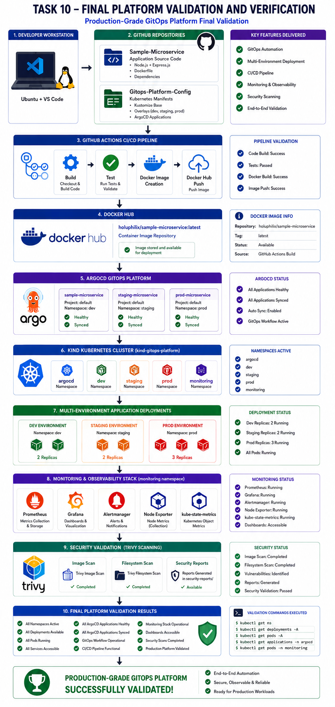
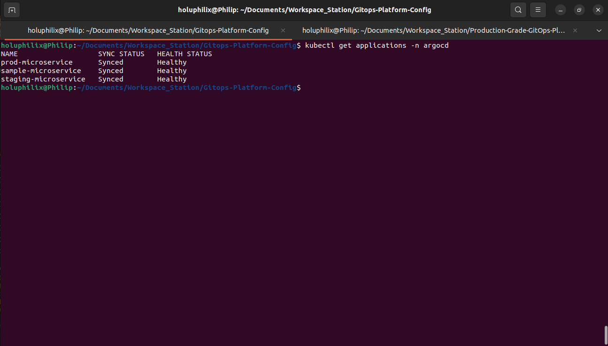
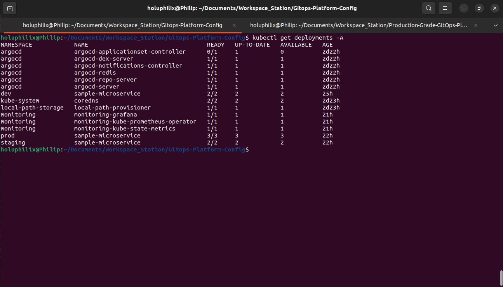
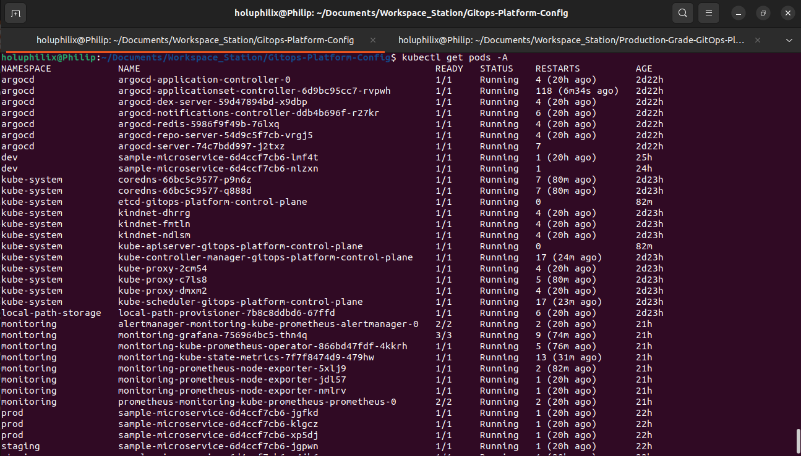
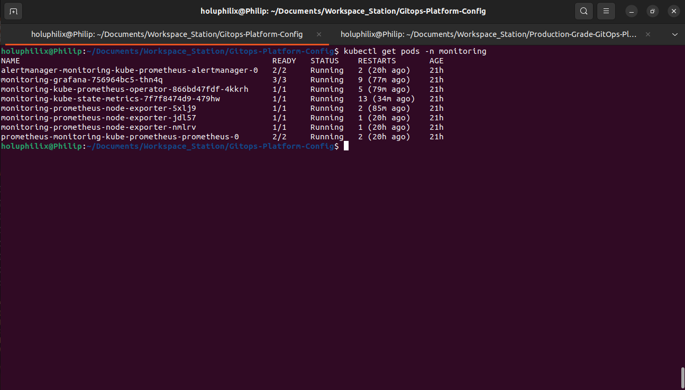
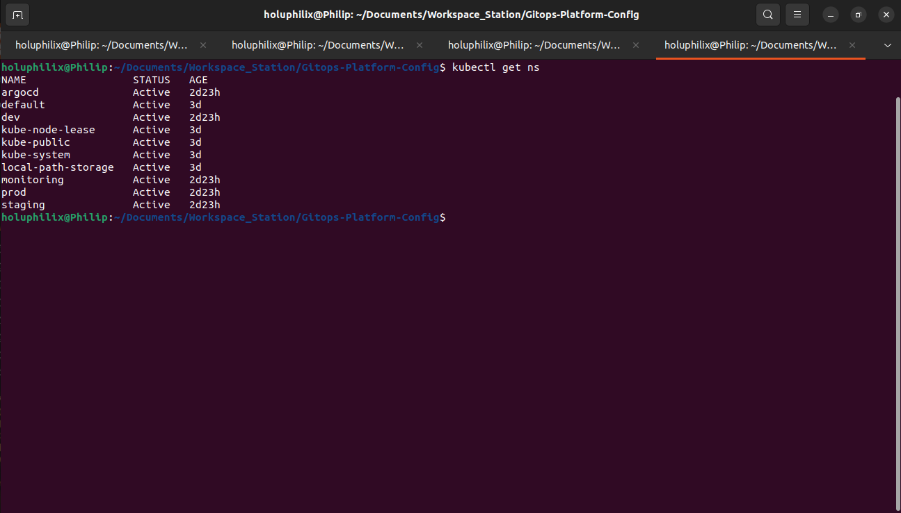
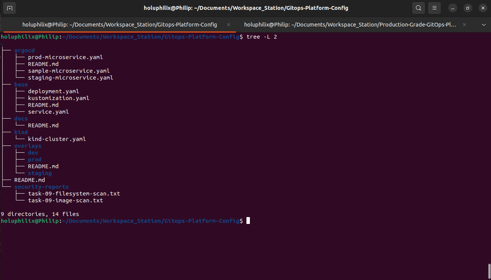
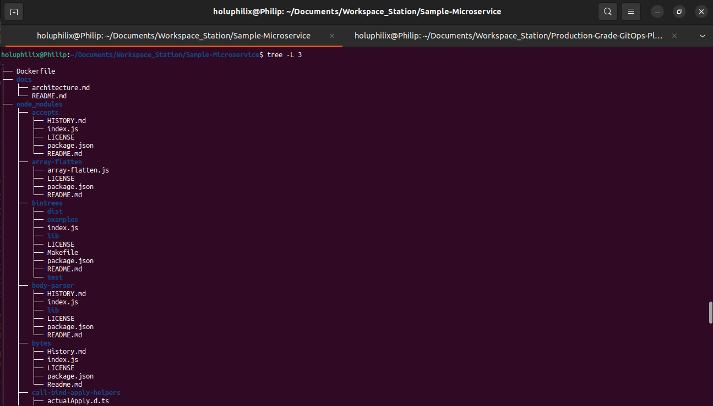
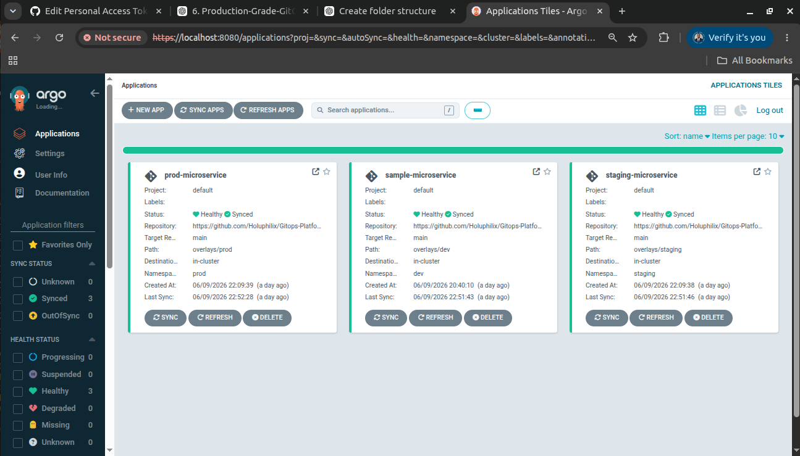

# 🚀 Task 10 - Final Validation and Documentation

## 🎯 Objective

Complete final platform validation for the Production-Grade GitOps Platform and confirm the project is ready for portfolio presentation.

## 📖 Background

This task closes the project by validating ArgoCD state, deployments, cluster pods, monitoring workloads, namespaces, repository structures, and the final dashboard view.

## 🏗️ Architecture Diagram



This diagram summarizes the workflow and technical scope for task 10 - final validation and documentation.

## 📋 Prerequisites

* Kind cluster running.
* ArgoCD Applications deployed.
* Multi-environment workloads available.
* Monitoring stack running.
* GitOps and CI/CD repositories available for structure validation.

## ⚙️ Implementation Steps

Implementation details are documented in the validation-specific sections below for ArgoCD Applications, deployments, pods, monitoring, namespaces, repositories, and final dashboard review.

## Task Overview
Complete final platform validation for the Production-Grade GitOps Platform.

This task confirms that the local Kind Kubernetes cluster, ArgoCD GitOps applications, multi-environment workloads, monitoring stack, security validation artifacts, GitOps repository, CI/CD repository, and project documentation are complete and operational.

## Objectives
The objectives of this final validation task were:

* Validate ArgoCD Application synchronization and health.
* Validate multi-environment deployments across `dev`, `staging`, and `prod`.
* Validate Kubernetes cluster workloads across all platform namespaces.
* Validate the monitoring stack in the `monitoring` namespace.
* Validate required Kubernetes namespaces.
* Validate the GitOps repository structure.
* Validate the CI/CD application repository structure.
* Confirm final ArgoCD dashboard state.
* Confirm project completion status.

## Validation Steps
The final validation process included:

1. Validate all ArgoCD Applications.
2. Validate Kubernetes deployments across all namespaces.
3. Validate running cluster pods.
4. Validate monitoring stack workloads.
5. Validate Kubernetes namespaces.
6. Validate GitOps repository structure.
7. Validate CI/CD repository structure.
8. Validate final ArgoCD dashboard state.

These checks provide end-to-end evidence that the platform was built, deployed, observed, scanned, and documented successfully.

## ArgoCD Application Validation
ArgoCD Applications were validated from the `argocd` namespace.

Validation command:

```bash
kubectl get applications -n argocd
```

Validated Applications:

* `sample-microservice`
* `staging-microservice`
* `prod-microservice`

Result:

* All Applications reached `Synced` status.
* All Applications reached `Healthy` status.

#### Screenshot Evidence: ArgoCD Applications Validation

The ArgoCD Application validation confirms that all GitOps-managed environments were synchronized and healthy.



Caption: ArgoCD Applications for dev, staging, and prod showing `Synced` and `Healthy` final validation status

## Multi-Environment Deployment Validation
Kubernetes deployments were validated across all namespaces.

Validation command:

```bash
kubectl get deployments -A
```

Validated environment deployments:

* `dev` deployment with `2/2` ready replicas.
* `staging` deployment with `2/2` ready replicas.
* `prod` deployment with `3/3` ready replicas.

The validation confirmed that Kustomize overlays enforced the expected replica counts and that ArgoCD synchronized the desired state into Kubernetes.

#### Screenshot Evidence: Multi-Environment Deployment Validation

The deployment validation confirms that all environment workloads reached the expected ready and available replica counts.



Caption: Kubernetes deployment validation showing dev, staging, and prod sample microservice deployments with expected ready replicas

## Cluster Pod Validation
Cluster pods were validated across all namespaces to confirm platform-wide runtime health.

Validation command:

```bash
kubectl get pods -A
```

Validated namespaces included:

* `argocd`
* `monitoring`
* `dev`
* `staging`
* `prod`
* `kube-system`
* `local-path-storage`

The validation confirmed that platform controllers, monitoring components, system components, and application workloads were running.

#### Screenshot Evidence: Cluster Pod Validation

The cluster pod validation confirms that workloads across the platform were running successfully.



Caption: Cluster-wide pod validation showing running ArgoCD, monitoring, application, storage, and system workloads

## Monitoring Stack Validation
The monitoring namespace was validated to confirm that the observability stack remained operational.

Validation command:

```bash
kubectl get pods -n monitoring
```

Validated components:

* Prometheus
* Grafana
* Alertmanager
* Node Exporter
* Kube State Metrics
* Prometheus Operator

The monitoring stack remained available for cluster and namespace observability.

#### Screenshot Evidence: Monitoring Stack Validation

The monitoring validation confirms that all key observability components were running in the `monitoring` namespace.



Caption: Monitoring namespace validation showing Prometheus, Grafana, Alertmanager, Node Exporter, Kube State Metrics, and Prometheus Operator running

## Namespace Validation
Kubernetes namespaces were validated to confirm that platform and application isolation was in place.

Validation command:

```bash
kubectl get ns
```

Validated namespaces:

* `argocd`
* `monitoring`
* `dev`
* `staging`
* `prod`
* `kube-system`
* `local-path-storage`

The validation confirmed that all required platform and application namespaces were present and active.

#### Screenshot Evidence: Namespace Validation

The namespace validation confirms that all required Kubernetes namespaces were available and active.



Caption: Kubernetes namespace validation showing active platform, application, monitoring, and system namespaces

## GitOps Repository Structure Validation
The GitOps repository structure was validated to confirm that deployment configuration, overlays, ArgoCD manifests, and security reports were organized correctly.

Validation command:

```bash
tree -L 2
```

Validated repository areas:

* `argocd`
* `base`
* `overlays`
* `kind`
* `security-reports`
* Repository documentation

This confirmed that the GitOps repository contains the declarative Kubernetes configuration required to reproduce the platform state.

#### Screenshot Evidence: GitOps Repository Structure Validation

The GitOps repository validation confirms that base manifests, overlays, ArgoCD Applications, Kind configuration, and security reports were present.



Caption: GitOps repository structure showing ArgoCD manifests, Kustomize base, environment overlays, Kind configuration, and security reports

## CI/CD Repository Validation
The application CI/CD repository structure was validated to confirm that application source, Docker assets, documentation, dependencies, and supporting files were present.

Validation command:

```bash
tree -L 3
```

Validated repository areas:

* Application Dockerfile
* Application documentation
* Node.js dependencies
* Application source and package metadata

This confirms that the application repository remains available as the source for build, test, scan, and image publication workflows.

#### Screenshot Evidence: CI/CD Repository Validation

The CI/CD repository validation confirms that the sample microservice repository structure was available for application delivery workflows.



Caption: Sample microservice repository structure showing Dockerfile, documentation, Node.js dependencies, and application package files

## Final ArgoCD Dashboard Validation
The final ArgoCD dashboard was reviewed to confirm that all GitOps Applications were visible, healthy, and synchronized.

Validated dashboard state:

* `prod-microservice` is `Healthy` and `Synced`.
* `sample-microservice` is `Healthy` and `Synced`.
* `staging-microservice` is `Healthy` and `Synced`.

This final dashboard view confirms that ArgoCD is actively managing independent dev, staging, and production deployments from the GitOps repository.

#### Screenshot Evidence: Final ArgoCD Dashboard

The final ArgoCD dashboard evidence confirms that all environment Applications were healthy and synchronized at project completion.



Caption: Final ArgoCD dashboard showing all dev, staging, and production Applications in `Healthy` and `Synced` state

## Results
Final validation completed successfully.

Validation results:

* ArgoCD Applications validated successfully.
* Multi-environment deployments validated successfully.
* Cluster pods validated successfully.
* Monitoring stack validated successfully.
* Namespaces validated successfully.
* GitOps repository structure validated successfully.
* CI/CD repository structure validated successfully.
* Final ArgoCD dashboard validated successfully.

## Key Achievements
The completed project demonstrates:

* A reproducible local Kubernetes platform using Kind.
* GitOps-based application delivery using ArgoCD.
* Declarative Kubernetes configuration using Kustomize.
* Multi-environment deployment management for `dev`, `staging`, and `prod`.
* Automated CI/CD workflow integration with container image delivery.
* Monitoring and observability with Prometheus, Grafana, Alertmanager, Node Exporter, Kube State Metrics, and Prometheus Operator.
* Security scanning with Trivy for container images and repository filesystem content.
* Operational evidence captured through screenshots and validation outputs.
* Final platform validation proving the project is complete.

## ⚙️ Commands Executed

Commands executed are documented throughout the validation sections below, including `kubectl get applications -n argocd`, `kubectl get deployments -A`, `kubectl get pods -A`, `kubectl get pods -n monitoring`, `kubectl get ns`, and repository `tree` commands.

## ✅ Validation

Validation evidence is documented in the task-specific sections above.

## 📸 Screenshots

### Task 10 Argocd Applications Validation


Caption: Task 10 final validation evidence across ArgoCD, deployments, pods, monitoring, namespaces, repositories, and dashboard state.

### Task 10 Deployments Validation


Caption: Task 10 final validation evidence across ArgoCD, deployments, pods, monitoring, namespaces, repositories, and dashboard state.

### Task 10 Cluster Pods Validation


Caption: Task 10 final validation evidence across ArgoCD, deployments, pods, monitoring, namespaces, repositories, and dashboard state.

### Task 10 Monitoring Validation


Caption: Task 10 final validation evidence across ArgoCD, deployments, pods, monitoring, namespaces, repositories, and dashboard state.

### Task 10 Namespace Validation


Caption: Task 10 final validation evidence across ArgoCD, deployments, pods, monitoring, namespaces, repositories, and dashboard state.

### Task 10 Gitops Repository Validation


Caption: Task 10 final validation evidence across ArgoCD, deployments, pods, monitoring, namespaces, repositories, and dashboard state.

### Task 10 Cicd Repository Validation


Caption: Task 10 final validation evidence across ArgoCD, deployments, pods, monitoring, namespaces, repositories, and dashboard state.

### Task 10 Final Argocd Dashboard


Caption: Task 10 final validation evidence across ArgoCD, deployments, pods, monitoring, namespaces, repositories, and dashboard state.

## 🎉 Key Outcomes

Final validation confirmed that the GitOps platform was complete, synchronized, healthy, observable, and documented.

## 📚 Lessons Learned

Final validation ties together platform operations, GitOps delivery, observability, security evidence, and repository readiness into a single project completion checkpoint.

## 🏁 Conclusion

The Task 10 - Final Validation and Documentation phase is complete and validated with documented operational evidence.
